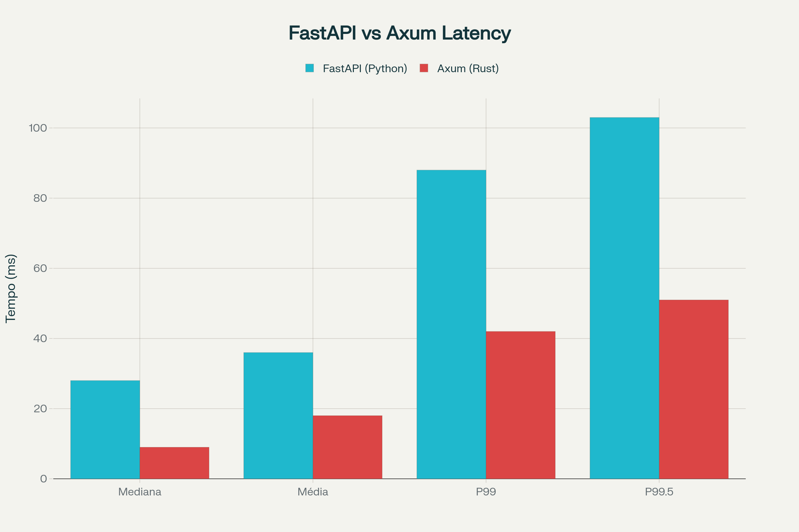

# Performance na prática: Um exemplo de real onde o Axum supera o FastAPI
###### Por [@zejuniortdr](https://github.com/zejuniortdr/) em Nov 16, 2025

Qual a stack perfeita para desenvolvimento? Essa é uma pergunta simples porém que trás muitas dúvidas, principalmente para quem está começando e a resposta nem sempre é óbvia: É a que resolve o problema da melhor maneira possível, consumindo menos recursos.

Claro que sempre existirão trade-offs, como por exemplo a curva de aprendizado, que pode ser maior uma determinada linguagem, principalmente quando esta é o Rust devido a sua forma única de trabalhar e as decisões de design da própria linguagem que é bem única em alguns pontos.

Neste post, a ideia é apresentar um exemplo prático onde através de um benchmark simples, é possível ver a diferença entre as duas.

## O escopo do projeto

Criar uma API Rest com um único endpoint `/api/v1/cep/{cep}` que receberá via *path param* e retornará os dados de endereço do CEP informado. Para otimizar a velocidade e reduzir o acoplamento  de um serviço externo, ao invés de depender 100% de uma API de terceiros, primeiro a requisição consultará no banco da própria aplicação, e somente em caso de não encontrar o registro, baterá no terceiro para retornar o dado solicitado e persistir no banco para uma consulta futura.


## Ambiente do Execução

- Hardware: Intel Core i7-2600K (8 cores) @ 3.80 GHz, 15.56 GiB RAM
- Sistema Operacional: EndeavourOS (Arch Linux)
- Banco de Dados: PostgreSQL em container Docker
- Condições: Mesma máquina, mesma configuração de banco, mesmo padrão de cache


### Stack Python:

- Python 3.13
- FastAPI 0.115.0
- Uvicorn com 4 workers
- psycopg (driver async)
- httpx para requisições HTTP

### Stack Rust

- Rust 1.90
- Axum 0.8.6
- Tokio runtime padrão
- sqlx para PostgreSQL
- reqwest para requisições HTTP


### Parâmetros do Teste:

- 20.000 requisições totais
- Concorrência: 50 conexões simultâneas
- Sem fase de warmup (cold start)
- Padrão de acesso: cache miss inicial → consulta ViaCEP → cache hits subsequentes
- Lib responsável para o teste de carga: Dril para ambos.


## Resultados Quantitativos

| Métrica                 | FastAPI (Python) | Axum (Rust) | Diferença  |
| ----------------------- | ---------------- | ----------- | ---------- |
| Requisições/segundo     | 1.356,92         | 2.773,98    | 2,04x      |
| Tempo total de execução | 14,7s            | 7,2s        | 2,04x      |
| Tempo mediano           | 28ms             | 9ms         | 3,11x      |
| Tempo médio             | 36ms             | 18ms        | 2,00x      |
| Percentil 99            | 88ms             | 42ms        | 2,09x      |
| Percentil 99.5          | 103ms            | 51ms        | 2,02x      |
| Percentil 99.9          | 2.048ms          | 1.901ms     | 1,08x      |
| Desvio padrão           | 97ms             | 96ms        | ~1,00x     |
| Requisições falhadas    | 0                | 0           | Ambas 100% |





A implementação Rust apresentou throughput duas vezes superior e latência mediana três vezes menor em comparação com a implementação Python.​

## Análise dos Percentis
**Comportamento Típico (Mediana)**
A mediana de 9ms para Axum versus 28ms para FastAPI indica que, em condições normais de operação, a implementação Rust responde em aproximadamente um terço do tempo.​

**Comportamento sob Carga (P99)**
O percentil 99 mostra que 99% das requisições da implementação Rust completam em até 42ms, enquanto a implementação Python atinge 88ms. Esta diferença é relevante para aplicações com requisitos de SLA rigorosos.​

**Casos Extremos (P99.9)**
Ambas as implementações apresentam spikes similares no percentil 99.9 (~2 segundos). Este comportamento sugere que os outliers não são causados pelos frameworks, mas provavelmente por contenção no PostgreSQL ou latência externa da API ViaCEP.​

## Fatores Técnicos de Performance

**Modelo de Compilação**
Python 3.13 executa bytecode através de um interpretador, mesmo com o JIT experimental que oferece melhorias de 2-9%. Rust compila para código de máquina nativo otimizado, eliminando overhead de interpretação.​​

**Concorrência e Paralelismo**
FastAPI com múltiplos workers do Uvicorn distribui carga entre processos, mas cada worker possui seu próprio Global Interpreter Lock (GIL), limitando paralelismo real dentro de cada processo. Rust com Tokio utiliza multi-threading nativo sem restrições de lock global.​

**Gerenciamento de Memória**
Python utiliza garbage collection com pausas imprevisíveis. Rust emprega ownership e borrowing, garantindo segurança de memória em tempo de compilação sem overhead de GC em runtime.​

**Ecossistema Assíncrono**
Ambas as implementações utilizam I/O assíncrono, mas o ecossistema Rust (Tokio + sqlx + reqwest) foi projetado com async como padrão desde a origem, resultando em menor overhead de abstração.​

**Considerações sobre sqlx**
É relevante notar que sqlx não é o driver PostgreSQL mais performático para Rust. Benchmarks do TechEmpower mostram que implementações com tokio-postgres direto alcançam posições significativamente superiores em rankings de performance, devido ao menor overhead de pool de conexões e prepared statements.​


## Estrutura dos Handlers

### Implementação com FastAPI**

```python

@app.get("/api/v1/cep/{cep}")
async def get_cep(cep: str):
    # Limpar CEP (remover hífen)
    cep_limpo = cep.replace("-", "")

    # Validar formato
    if len(cep_limpo) != 8 or not cep_limpo.isdigit():
        raise HTTPException(status_code=400, detail="CEP inválido")

    # Buscar no banco
    async with db_pool.connection() as conn:
        async with conn.cursor(row_factory=dict_row) as cur:
            await cur.execute(
                "SELECT * FROM ceps WHERE cep = %s",
                (cep_limpo,)
            )
            row = await cur.fetchone()

            if row:
                return dict(row)

    # Fallback para ViaCEP
    try:
        response = await http_client.get(f"{VIACEP_URL}/{cep_limpo}/json/")
        response.raise_for_status()
        data = response.json()

        # Verificar se CEP existe
        if "erro" in data:
            raise HTTPException(status_code=404, detail="CEP não encontrado")

        # Salvar no banco
        async with db_pool.connection() as conn:
            async with conn.cursor() as cur:
                await cur.execute("""
                    INSERT INTO ceps (
                        cep, logradouro, complemento, bairro,
                        localidade, uf, ibge, gia, ddd, siafi
                    ) VALUES (%s, %s, %s, %s, %s, %s, %s, %s, %s, %s)
                    ON CONFLICT (cep) DO NOTHING
                """, (
                    data.get("cep", "").replace("-", ""),
                    data.get("logradouro", ""),
                    data.get("complemento", ""),
                    data.get("bairro", ""),
                    data.get("localidade", ""),
                    data.get("uf", ""),
                    data.get("ibge", ""),
                    data.get("gia", ""),
                    data.get("ddd", ""),
                    data.get("siafi", "")
                ))
                await conn.commit()

        return data

    except httpx.HTTPError as e:
        raise HTTPException(status_code=503, detail=f"Erro ao consultar ViaCEP: {str(e)}")
```

### Características técnicas:
- Validação e serialização automática via Pydantic
- Type hints opcionais verificados em runtime
- Tratamento de exceções com try/except
- Syntax concisa e expressiva


## Implementação com Axum

```rust
pub async fn get_zipcode_handler(
    State(state): State<AppState>,
    Path(cep): Path<String>,
) -> Response {
    dotenv().ok();

    let sanitized_zipcode = match cep_service::validate_cep(&cep) {
        Ok(valid_cep) => valid_cep,
        Err(error_response) => return *error_response,
    };

    let search_zipcode_on_viacep = env::var("SEARCH_ZIPCODE_ON_VIACEP")
        .unwrap_or_else(|_| "false".to_string())
        .to_lowercase()
        == "true";

    let strategy = cep_service::SearchStrategy::WithFallback {
        enable_viacep: search_zipcode_on_viacep
    };

    let result = cep_service::execute_search(&state, &sanitized_zipcode, strategy).await;

    cep_service::search_result_to_response(result, "")
}
```

**Serviço auxiliar**
```rust
pub async fn execute_search(
        state: &AppState,
        cep: &str,
        strategy: SearchStrategy,
    ) -> SearchResult {
        match strategy {
            SearchStrategy::Single(provider) => match provider {
                Provider::Database => search_in_database(state, cep).await,
                Provider::ViaCep => search_in_viacep(state, cep, Some(false)).await,
            },
            SearchStrategy::WithFallback {
                enable_viacep,
            } => match search_in_database(state, cep).await {
                SearchResult::Found(response) => SearchResult::Found(response),
                SearchResult::Error(err) => SearchResult::Error(err),
                SearchResult::NotFound => {
                    if enable_viacep {
                        match search_in_viacep(state, cep, Some(true)).await {
                            SearchResult::Found(response) => return SearchResult::Found(response),
                            SearchResult::Error(err) => return SearchResult::Error(err),
                            SearchResult::NotFound => {}
                        }
                    }
                    SearchResult::NotFound
                }
            },
        }
    }

pub async fn search_in_database(state: &AppState, cep: &str) -> SearchResult {
        let result = sqlx::query_as!(
            CepResponse,
            r#"
            SELECT
                l.cep,
                COALESCE(l.logradouro, '') as "logradouro!",
                COALESCE(b.nome, '') as "bairro!",
                c.nome as "cidade!",
                e.sigla as "estado!",
                l.created_at,
                'database' as "provider!: String"
            FROM logradouro l
            INNER JOIN cidade c ON l.id_cidade = c.id
            INNER JOIN estado e ON c.id_estado = e.id
            LEFT JOIN bairro b ON l.id_bairro = b.id
            WHERE l.cep = $1
            "#,
            cep
        )
        .fetch_optional(&state.db)
        .await;

        match result {
            Ok(Some(response)) => {
                tracing::info!("Found zipcode in database: {}", cep);
                SearchResult::Found(response)
            }
            Ok(None) => {
                tracing::info!("CEP não encontrado no banco: {}", cep);
                SearchResult::NotFound
            }
            Err(e) => {
                tracing::error!("Erro ao consultar banco de dados: {}", e);
                SearchResult::Error(format!("Erro ao consultar banco de dados: {}", e))
            }
        }
    }

    /// Busca CEP no ViaCep
    pub async fn search_in_viacep(
        state: &AppState,
        cep: &str,
        save_in_db: Option<bool>,
    ) -> SearchResult {
        let viacep_client: ViaCepClient = ViaCepClient::new();
        let must_save = save_in_db.unwrap_or(true);

        match viacep_client.buscar_cep(cep).await {
            Ok(viacep_response) => {
                tracing::info!("CEP {} encontrado no ViaCep", cep);

                if !must_save {
                    return SearchResult::Found(viacep_response);
                }

                if let Err(e) = salvar_cep(state, &viacep_response).await {
                    tracing::error!("Erro ao salvar CEP {} no banco: {}", cep, e);
                }

                SearchResult::Found(viacep_response)
            }
            Err(err) => {
                match err {
                    CepApiError::CepNotFound => {
                        tracing::warn!("CEP {} não encontrado no ViaCep", cep);
                        SearchResult::NotFound
                    }
                    CepApiError::InvalidCep => {
                        tracing::warn!("CEP {} inválido", cep);
                        SearchResult::Error("CEP inválido".to_string())
                    }
                    CepApiError::RequestError(msg) => {
                        tracing::warn!("Erro de request no ViaCep: {}", msg);
                        SearchResult::NotFound // Trata como not found para continuar fallback
                    }
                    CepApiError::HttpError(code) => {
                        tracing::warn!("Erro HTTP no ViaCep: código {}", code);
                        SearchResult::NotFound // Trata como not found para continuar fallback
                    }
                    CepApiError::ParseError(msg) => {
                        tracing::warn!("Erro de parsing no ViaCep: {}", msg);
                        SearchResult::NotFound // Trata como not found para continuar fallback
                    }
                }
            }
        }
    }
```


### Características técnicas:

- Type safety absoluto verificado em compile-time
- Pattern matching para tratamento de erros com `Result<T, E>`
- Sistema de ownership previne erros de memória
- Serialização zero-copy quando possível via serde


## Casos de Uso para Cada Stack

### Quando FastAPI é Adequado

**Desenvolvimento Rápido:** Para prototipagem e MVPs, onde velocidade de implementação é prioritária. O tempo de desenvolvimento em Python é significativamente menor.​

**Ecossistema Rico:** Projetos que requerem integração com bibliotecas de machine learning (TensorFlow, PyTorch), data science (pandas, numpy) ou outras ferramentas do ecossistema Python.​

**Curva de Aprendizado:** Equipes que precisam de produtividade imediata. Desenvolvedores júnior podem contribuir efetivamente com Python em dias, enquanto Rust requer semanas de aprendizado.​

**Gargalos Externos:** Aplicações onde o tempo de processação é dominado por operações de I/O lentas (queries não otimizadas, APIs externas). Nestes casos, otimização da linguagem tem impacto marginal.​

### Quando Axum é Adequado
**Alto Volume:** Sistemas que precisam processar milhares de requisições por segundo, onde eficiência computacional impacta diretamente custos de infraestrutura.

**Requisitos de Latência:** APIs públicas ou microserviços internos com SLAs rigorosos de tempo de resposta.

**Estabilidade de Longo Prazo:** Sistemas que evoluem lentamente e se beneficiam de garantias de type safety e memory safety em compile-time.

**Otimização de Custos:** Ambientes onde a redução do número de servidores ou instâncias cloud resulta em economia significativa.

---

## Reteste com FastAPI + Gunicorn (8 Workers)

Após a publicação inicial, o [@gleberdiniz](https://github.com/gleberdiniz), depois de revisar o material,  sugeriu testar a implementação FastAPI com configuração de produção usando Gunicorn com múltiplos workers, argumentando que a comparação seria mais justa ao explorar melhor o paralelismo disponível no hardware de 8 núcleos.

### Configuração do Teste Revisado

**Instalação das dependências:**
```bash
pipenv install gunicorn uvicorn
```

**Comando de execução:**
```bash
gunicorn app:app \
  --workers 8 \
  --worker-class uvicorn.workers.UvicornWorker \
  --bind 0.0.0.0:8000
```

**Parâmetros do teste:**
- Mesmos 20.000 requisições
- Mesma concorrência de 50 conexões
- Mesmo ambiente de hardware e banco de dados

### Novos Resultados Quantitativos

| Métrica                 | FastAPI (4 workers) | FastAPI (8 workers) | Axum (Rust) | Melhoria 8w vs 4w | Gap Axum vs 8w |
| ----------------------- | ------------------- | ------------------- | ----------- | ----------------- | -------------- |
| Requisições/segundo     | 1.356,92            | 2.470,25            | 2.773,98    | +82,0%            | 1,12x          |
| Tempo total de execução | 14,7s               | 8,1s                | 7,2s        | -44,9%            | 1,12x          |
| Tempo mediano           | 28ms                | 21ms                | 9ms         | -25,0%            | 2,33x          |
| Tempo médio             | 36ms                | 20ms                | 18ms        | -44,4%            | 1,11x          |
| Percentil 99            | 88ms                | 48ms                | 42ms        | -45,5%            | 1,14x          |
| Percentil 99.5          | 103ms               | 56ms                | 51ms        | -45,6%            | 1,10x          |
| Percentil 99.9          | 2.048ms             | 631ms               | 1.901ms     | -69,2%            | 3,01x          |
| Desvio padrão           | 97ms                | 33ms                | 96ms        | -66,0%            | 2,91x          |

### Análise dos Resultados Revisados

**Throughput Comparável**
Com 8 workers, FastAPI alcançou 2.470 req/s, reduzindo significativamente a diferença para o Axum (2.774 req/s). A vantagem do Rust diminuiu de 2,04x para apenas 1,12x em throughput bruto.

**Latência Ainda Superior no Rust**
Apesar do throughput próximo, a latência mediana do Axum (9ms) permanece 2,33x menor que o FastAPI com 8 workers (21ms). Esta diferença é crítica para aplicações sensíveis a tempo de resposta.

**Percentis Altos Melhoraram Drasticamente**
O P99.9 do FastAPI caiu de 2.048ms para 631ms, uma melhoria de 69%. Isto sugere que o gargalo anterior estava mais relacionado à saturação dos workers do que a limitações fundamentais da stack Python.

**Estabilidade e Consistência**
O desvio padrão do FastAPI caiu de 97ms para 33ms, indicando respostas mais consistentes. Curiosamente, o Axum manteve desvio padrão alto (96ms), provavelmente relacionado a outliers externos (banco de dados ou ViaCEP).


Também como sugestão do [@gleberdiniz](https://github.com/gleberdiniz), foi refeito ambos os testes (Axum e FastAPI com 8 workers) monitorando cpu e memória.

Os três primeiros picos de CPU foram os testes com FastAPI e chegou até 90%, enqunto os três últimos foram com o Axum parando em 70% do consumo, uma diferença de 20% de CPU menor.

Já memória não apresentou picos relavantes, além do platô quase no fim do gráfico quando foi aberto o editor para rodar os testes e se manteve bem estável com 25% de uso para ambos.

### Problema Crítico Encontrado: Esgotamento de Conexões

Ao final do teste com 8 workers, o seguinte erro foi registrado:

```
error connecting in 'pool-1': connection failed: connection to server at "127.0.0.1",
port 5432 failed: FATAL: sorry, too many clients already
```

**Análise do Problema:**
A configuração original do pool (`min_size=10, max_size=20`) multiplicada por 8 workers resulta em:
- Mínimo: 80 conexões simultâneas
- Máximo: 160 conexões simultâneas

O PostgreSQL padrão limita conexões em 100, causando esgotamento sob carga. Este é um problema clássico de tuning que afeta qualquer stack ao escalar horizontalmente.

**Recomendações:**
1. Ajustar pool por worker: `min_size=2, max_size=5` (16-40 conexões totais)
2. Aumentar limite do PostgreSQL: `max_connections=200` no postgresql.conf
3. Considerar PgBouncer para pooling externo em produção

### Implicações para a Comparação Original

**O teste inicial não foi justo?**
Parcialmente. Com 4 workers, o FastAPI não utilizava plenamente o hardware de 8 núcleos. No entanto, a escolha de 4 workers foi intencional e documentada, refletindo uma configuração comum em ambientes de produção.

**Por que 4 workers era a configuração inicial?**
A fórmula `(2 × núcleos) + 1` sugere 17 workers para 8 núcleos, mas na prática, desenvolvedores frequentemente usam configurações conservadoras para evitar contenção excessiva e simplificar debugging.

**Qual configuração é mais realista?**
Ambas são válidas dependendo do contexto:
- **4 workers**: Mais estável, menor consumo de memória, debugging mais simples
- **8 workers**: Maior throughput, requer tuning cuidadoso de recursos (conexões DB, file descriptors, memória)

### Conclusão Revisada

Com configuração otimizada de 8 workers, o FastAPI demonstrou que Python pode alcançar throughput competitivo com Rust em aplicações I/O bound. A diferença de 12% em requisições por segundo torna-se marginal para muitas aplicações.

No entanto, três vantagens fundamentais do Axum permanecem:

1. **Latência consistentemente menor**: 2,33x melhor na mediana, crítico para APIs de baixa latência
2. **Configuração mais simples**: Não requer tuning complexo de workers e pools de conexão
3. **Eficiência de recursos**: Menor consumo de memória e CPU por requisição

A escolha entre as stacks deve considerar:
- **FastAPI**: Ideal quando throughput é suficiente e velocidade de desenvolvimento/manutenção é prioritária
- **Axum**: Necessário quando latência, eficiência de recursos ou escala extrema são requisitos críticos

O benchmark revisado reforça que otimização de deployment é tão importante quanto a escolha da linguagem. Uma stack "inferior" bem configurada pode superar uma stack "superior" mal configurada.

---

## Conclusões Finais

Os testes demonstram que Rust com Axum oferece vantagens mensuráveis de performance, mas o gap não é tão dramático quanto benchmarks sintéticos sugerem. Em aplicações I/O bound reais, a diferença entre stacks bem configuradas tende a ser menor que em CPU-bound workloads.​

A decisão técnica adequada depende do contexto específico de cada projeto: volume esperado de tráfego, requisitos de latência, expertise da equipe, velocidade de iteração necessária e restrições de custo operacional. O reteste com 8 workers demonstra que tuning adequado é frequentemente mais impactante que a escolha da linguagem.
