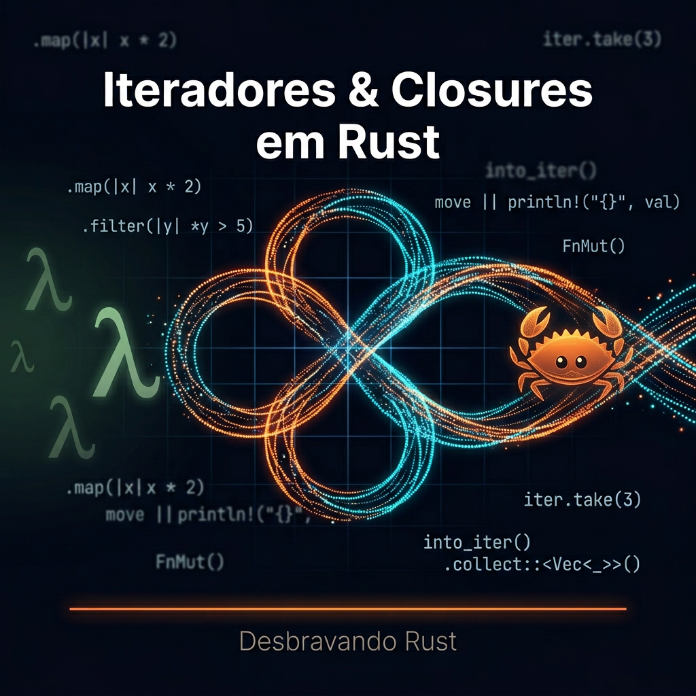

# Desvendando Iteradores e Closures em Rust: A Potência Funcional para Pythonistas



Se você vem do Python e está começando sua jornada em Rust, provavelmente já percebeu que ambas as linguagens possuem recursos poderosos para programação funcional. No entanto, as semelhanças superficiais escondem diferenças profundas que são cruciais para entender como Rust oferece segurança de memória e desempenho superior.

Neste artigo, vamos explorar como closures e iteradores funcionam em Rust, comparando constantemente com as abordagens do Python. Você descobrirá como Rust implementa esses conceitos de forma única, proporcionando tanto flexibilidade quanto segurança em tempo de compilação.

## Por Que Closures e Iteradores São Fundamentais?

Tanto em Python quanto em Rust, closures e iteradores são pilares da programação funcional. Eles permitem:
- Escrever código mais conciso e expressivo
- Manipular coleções de dados de forma elegante
- Criar abstrações poderosas com pouco código

Mas enquanto Python prioriza flexibilidade e legibilidade, Rust adiciona uma camada de segurança e eficiência que previne erros comuns em tempo de compilação.

Vamos começar nossa jornada entendendo as closures, uma das construções mais interessantes em Rust!

## Seção 1: Entendendo Closures em Rust

### O Que São Closures?

Closures são funções anônimas que podem capturar variáveis do seu ambiente circundante. Se você já usou `lambda` em Python, já trabalhou com closures!

**Python:**
```python
# Closure simples em Python
def multiplicador_por(n):
    def multiplicador(x):
        return x * n
    return multiplicador

dobro = multiplicador_por(2)
print(dobro(5))  # Output: 10
```

**Rust:**
```rust
// Closure simples em Rust com tipos explícitos
fn multiplicador_por(n: i32) -> impl Fn(i32) -> i32 {
    move |x| x * n
}

fn main() {
    let dobro = multiplicador_por(2);
    println!("{}", dobro(5));  // Output: 10
}
```

> **Nota sobre `impl Fn`:** Em Rust, ao retornar uma closure de uma função, usamos `impl Fn(...)` para indicar o tipo de retorno. Isso é mais eficiente que `Box<dyn Fn(...)>` pois não exige alocação no heap. A palavra-chave `move` faz a closure **adquirir posse** (_ownership_) da variável `n`, garantindo que ela permaneça válida mesmo após a função retornar.

> **Ownership em poucas palavras:** Rust tem um sistema único onde cada valor tem um único "dono". Quando usamos `move`, transferimos a posse da variável para dentro da closure — isso é fundamental para garantir segurança de memória sem garbage collector!

### Os Três Traits de Closures: Fn, FnMut e FnOnce

Em Rust, **traits** são interfaces que definem comportamentos. Para closures, existem três traits que determinam como elas interagem com as variáveis capturadas:

1. **Fn**: Apenas empresta variáveis (read-only) — pode ser chamada várias vezes
2. **FnMut**: Empresta variáveis mutavelmente — pode modificá-las a cada chamada
3. **FnOnce**: Adquire posse das variáveis — pode ser chamada apenas uma vez

Vamos ver exemplos práticos:

```rust
fn main() {
    let valor = 10;

    // Fn: apenas empresta 'valor'
    let closure_fn = || println!("Valor: {}", valor);
    closure_fn();
    closure_fn();  // Pode ser chamada múltiplas vezes

    // FnMut: empresta 'valor' mutavelmente
    let mut valor_mut = 10;
    let mut closure_fnmut = || {
        valor_mut += 1;
        println!("Valor mut: {}", valor_mut);
    };
    closure_fnmut();
    closure_fnmut();

    // FnOnce: adquire posse de 'valor_once'
    let valor_once = String::from("Hello");
    let closure_fnonce = move || {
        println!("Valor: {}", valor_once);
        // valor_once é consumido aqui (drop ao final da closure)
    };
    closure_fnonce();
    // closure_fnonce();  // Erro! Não pode ser chamada novamente
}
```

### Closure com Estado Mutável

Uma das aplicações mais poderosas das closures é manter estado interno. Isso é especialmente útil para criar contadores, acumuladores e geradores:

```rust
// Closure que mantém estado mutável
fn contador() -> impl FnMut() -> i32 {
    let mut count = 0;
    move || {
        count += 1;
        count
    }
}

fn main() {
    let mut contar = contador();
    println!("{}", contar()); // 1
    println!("{}", contar()); // 2
    println!("{}", contar()); // 3
}
```

Note que `FnMut` é necessário aqui porque a closure modifica `count` a cada chamada. O tipo de retorno `impl FnMut() -> i32` informa ao compilador que estamos retornando algo que implementa o trait `FnMut`.

### Captura de Variáveis: As Diferenças Cruciais

Aqui está onde Rust brilha em comparação com Python. Enquanto Python usa referências e garbage collection, Rust exige que você seja explícito sobre como as variáveis são capturadas.

**Python (com comportamento potencialmente problemático):**
```python
def criar_closures():
    closures = []
    for i in range(3):
        closures.append(lambda: print(f"Valor: {i}"))
    return closures

# Todas as closures imprimem "Valor: 2"!
for closure in criar_closures():
    closure()
```

**Rust (comportamento correto por padrão):**
```rust
fn criar_closures() -> Vec<Box<dyn Fn()>> {
    // Box<dyn Fn()> é necessário para armazenar closures de tamanhos distintos
    // em um Vec. 'dyn' indica despacho dinâmico (trait object).
    (0..3)
        .map(|i| Box::new(move || println!("Valor: {}", i)) as Box<dyn Fn()>)
        .collect()
}

fn main() {
    // Cada closure tem sua própria cópia de i
    for closure in criar_closures() {
        closure();  // Imprime 0, 1, 2
    }
}
```

> **Por que `Box<dyn Fn()>`?** Cada closure em Rust tem um tipo único e anônimo — o compilador não consegue determinar o tamanho exato em tempo de compilação quando armazenamos closures diferentes em um mesmo `Vec`. `Box<dyn Fn()>` resolve isso alocando a closure no heap com tamanho fixo (um ponteiro). Quando você retorna uma única closure de uma função, prefira `impl Fn()` por ser mais eficiente.

Rust força você a pensar sobre ownership desde o início, prevenindo erros sutis que são comuns em Python!

## Seção 2: Dominando Iteradores em Rust

Closures e iteradores caminham juntos em Rust — os adaptadores como `map` e `filter` recebem closures como argumento. Vamos explorar como os iteradores funcionam e como combiná-los com closures para criar pipelines poderosos.

### `iter()`, `iter_mut()` e `into_iter()`: Quando Usar Cada Um

Antes de avançar, é essencial entender as três formas de iterar sobre uma coleção em Rust. Elas diferem fundamentalmente em como tratam o **ownership**:

| Método | Tipo de acesso | O que acontece com a coleção |
|---|---|---|
| `.iter()` | `&T` — referência imutável | Coleção continua disponível |
| `.iter_mut()` | `&mut T` — referência mutável | Coleção continua disponível |
| `.into_iter()` | `T` — posse do valor | Coleção é consumida (movida) |

```rust
fn main() {
    let mut numeros = vec![1, 2, 3];

    // iter(): empréstimo imutável — numeros ainda existe depois
    let soma: i32 = numeros.iter().sum();
    println!("Soma: {}", soma);

    // iter_mut(): empréstimo mutável — modifica os valores no lugar
    numeros.iter_mut().for_each(|n| *n *= 2);
    println!("Dobrados: {:?}", numeros); // [2, 4, 6]

    // into_iter(): adquire posse — numeros não pode mais ser usado
    let resultado: Vec<_> = numeros.into_iter().filter(|&n| n > 2).collect();
    println!("Filtrados: {:?}", resultado); // [4, 6]
    // println!("{:?}", numeros); // ERRO: numeros foi movido para o iterador
}
```

### FromIterator e IntoIterator: A Magia Por Trás dos Iteradores

Em Rust, iteradores são **preguiçosos** por padrão — eles não fazem nada até que você os consuma. Isso é diferente do Python, onde muitas operações são **imediatas** (executadas no momento da chamada).

Os dois traits mais importantes são:
- **IntoIterator**: Converte algo em um iterador
- **FromIterator**: Constrói uma coleção a partir de um iterador

```rust
fn main() {
    let numeros = vec![1, 2, 3, 4, 5];

    // IntoIterator: converte Vec em iterador (move a posse de 'numeros')
    let iterador = numeros.into_iter();
    // Aqui, 'numeros' foi movido — não pode mais ser acessado

    // FromIterator: .collect() usa FromIterator para construir a nova coleção
    let novos_numeros: Vec<_> = iterador.collect();
    println!("{:?}", novos_numeros); // [1, 2, 3, 4, 5]
}
```

### As Poderosas Adaptações: map, filter, collect

Aqui está onde a programação funcional realmente brilha em Rust! Vamos comparar com Python:

**Python (avaliação imediata):**
```python
# Python: operações são aplicadas imediatamente
numeros = [1, 2, 3, 4, 5]
resultado = [x * 2 for x in numeros if x % 2 == 0]
print(resultado)  # [4, 8]
```

**Rust (avaliação preguiçosa):**
```rust
fn main() {
    let numeros = vec![1, 2, 3, 4, 5];

    // Rust: operações são preguiçosas, só executam quando consumidas
    let resultado: Vec<_> = numeros
        .into_iter()
        .filter(|x| x % 2 == 0)
        .map(|x| x * 2)
        .collect();

    println!("{:?}", resultado);  // [4, 8]
}
```

A beleza da abordagem Rust é que o compilador pode otimizar toda a cadeia de operações sem alocações intermediárias desnecessárias!

### Adaptadores Avançados: chain, step_by e take

Além de `map` e `filter`, Rust oferece uma rica biblioteca de adaptadores que permitem construir pipelines sofisticados:

```rust
fn main() {
    // chain: concatena dois iteradores
    // step_by: pula N elementos entre cada item
    // take: limita o total de elementos retornados
    let resultado = (1..100)
        .chain(200..300)
        .step_by(2)
        .take(10)
        .collect::<Vec<_>>();

    println!("{:?}", resultado); // [1, 3, 5, 7, 9, 11, 13, 15, 17, 19]

    // Combinando closures com iteradores: flat_map, zip, fold
    let palavras = vec!["olá mundo", "rust é incrível"];
    let letras_unicas: std::collections::HashSet<char> = palavras
        .iter()
        .flat_map(|s| s.chars())
        .filter(|c| c.is_alphabetic())
        .collect();

    println!("Total de letras únicas: {}", letras_unicas.len());
}
```

### Exemplo Prático: Processando Dados de Sensor

Vamos criar um exemplo mais complexo e realista que combina closures e iteradores em um pipeline completo:

```rust
struct LeituraSensor {
    valor: f64,
    timestamp: i64,
    valida: bool,
}

fn processar_leitura(leituras: Vec<LeituraSensor>) -> Vec<(i64, f64)> {
    leituras
        .into_iter()
        .filter(|leitura| leitura.valida)           // Filtra leituras válidas
        .filter(|leitura| leitura.valor >= 0.0)     // Valores não-negativos
        .map(|leitura| (leitura.timestamp, leitura.valor * 1.5))  // Transforma
        .filter(|(_, valor)| *valor <= 100.0)       // Remove valores excessivos
        .collect()                                   // Coleta em Vec
}

fn main() {
    let leituras = vec![
        LeituraSensor { valor: 25.5, timestamp: 1000, valida: true },
        LeituraSensor { valor: -5.0, timestamp: 1001, valida: true },
        LeituraSensor { valor: 75.0, timestamp: 1002, valida: false },
        LeituraSensor { valor: 150.0, timestamp: 1003, valida: true },
    ];

    let resultado = processar_leitura(leituras);
    println!("{:?}", resultado);  // [(1000, 38.25)]
}
```

Este exemplo mostra como Rust permite criar pipelines de processamento de dados claros, seguros e eficientes!

## Seção 3: Avaliação Preguiçosa vs Avaliação Imediata

### A Filosofia de Cada Linguagem

**Python (Imediata):**
- Operações são executadas no momento da chamada
- Mais fácil de depurar (você vê resultados intermediários)
- Pode consumir mais memória (cria listas intermediárias)

**Rust (Preguiçosa):**
- Operações só acontecem quando os resultados são realmente necessários
- Permite otimizações poderosas (fusão de iteradores, eliminação de alocações)
- Mais eficiente em termos de memória e desempenho

### Exemplo de Performance

Vamos comparar o processamento de grandes conjuntos de dados:

**Python (com list comprehensions):**
```python
# Python: cria listas intermediárias na memória
import time

dados = list(range(1_000_000))

inicio = time.time()
resultado = [x * 2 for x in dados if x % 3 == 0]
fim = time.time()
print(f"Tempo: {(fim - inicio):.4f}s")
print(f"Tamanho do resultado: {len(resultado)}")
```

**Rust (com iteradores preguiçosos):**
```rust
// Rust: não cria coleções intermediárias
use std::time::Instant;

fn main() {
    let dados: Vec<_> = (1..1_000_000).collect();

    let inicio = Instant::now();
    let resultado: Vec<_> = dados
        .into_iter()
        .filter(|x| x % 3 == 0)
        .map(|x| x * 2)
        .collect();
    let duracao = inicio.elapsed();

    println!("Tempo: {:.4?}s", duracao);
    println!("Tamanho do resultado: {}", resultado.len());
}
```

Em benchmarks, a versão Rust geralmente é 2-3x mais rápida e consome significativamente menos memória!

### Zero-Cost Abstractions e Loop Fusion

Um dos pontos mais impressionantes do sistema de iteradores em Rust é que toda essa expressividade não tem custo em tempo de execução:

- **Loop Fusion**: O compilador une automaticamente múltiplos `filter` e `map` em um único loop, sem iterações intermediárias
- **Inlining automático**: Closures passadas para iteradores geralmente são embutidas diretamente no código gerado
- **Sem alocações desnecessárias**: Adaptadores como `map`, `filter`, `chain` não alocam memória — apenas descrevem a transformação

Isso é o que Rust chama de **zero-cost abstractions**: você escreve código de alto nível, mas o compilador gera código tão eficiente quanto um loop manual em C.

## Comparação com Python: Quando Cada Abordagem Brilha

### List Comprehensions vs Iteradores Rust

**Python (list/dict/set comprehensions):**
```python
# Python é excelente para expressões concisas
quadrados_pares = [x**2 for x in range(10) if x % 2 == 0]
dicionario = {x: x**2 for x in range(5)}
conjunto = {x for x in "abracadabra" if x not in "abc"}
```

**Rust (iteradores):**
```rust
// Rust é mais explícito mas igualmente poderoso
let quadrados_pares: Vec<_> = (0..10)
    .filter(|x| x % 2 == 0)
    .map(|x| x.pow(2))
    .collect();

let dicionario: std::collections::HashMap<_, _> = (0..5)
    .map(|x| (x, x.pow(2)))
    .collect();

let conjunto: std::collections::HashSet<_> = "abracadabra"
    .chars()
    .filter(|c| !"abc".contains(*c))
    .collect();
```

### Generators Python vs Iteradores Rust

**Python (generators):**
```python
# Generator expression (avaliação preguiçosa)
quadrados = (x**2 for x in range(1000000))
soma = sum(quadrados)  # Consome o generator
```

**Rust (iteradores):**
```rust
// Iteradores Rust são sempre preguiçosos
let quadrados = (0..1_000_000u64).map(|x| x.pow(2));
let soma: u64 = quadrados.sum();  // Consome o iterador
```

### Erros Comuns de Pythonistas em Rust

1. **Esquecer o `collect()`:**
```rust
// ERRO: Iteradores são preguiçosos — isso não processa nada!
let resultado = vec![1, 2, 3].iter().map(|x| x * 2);
// CORRETO:
let resultado: Vec<_> = vec![1, 2, 3].iter().map(|x| x * 2).collect();
```

2. **Problemas de ownership em closures:**
```rust
// ERRO: Tentar usar variável após mover para closure
let dados = vec![1, 2, 3];
let closure = move || println!("{:?}", dados);
println!("{:?}", dados);  // Erro! dados foi movido para a closure
```

3. **Confusão entre `iter()`, `into_iter()`, `iter_mut()`:**
```rust
let mut numeros = vec![1, 2, 3];

// iter(): empréstimo imutável — coleção continua disponível
for n in numeros.iter() { /* lê &n */ }

// iter_mut(): empréstimo mutável — permite modificar os valores
for n in numeros.iter_mut() { *n *= 2; }

// into_iter(): adquire posse — consome o vetor
for n in numeros.into_iter() { /* n é dono do valor */ }
// numeros não existe mais aqui!
```

## Conclusão: Por Que Rust Vale a Pena para Programação Funcional

Rust oferece o melhor dos dois mundos: a expressividade da programação funcional combinada com o desempenho e segurança de sistemas.

**Use Rust quando:**
- Você precisa de máximo desempenho e eficiência de memória
- A segurança contra erros é crítica (sistemas concorrentes, código de longa duração)
- Você está trabalhando com grandes volumes de dados

**Use Python quando:**
- A velocidade de desenvolvimento é prioridade
- Você está prototipando ou explorando dados
- O código não é performance-critical

## O Que Aprendemos

- **Closures Rust** são mais poderosas e seguras que as do Python, com sistema explícito de ownership
- **Traits Fn, FnMut, FnOnce** definem como closures capturam e interagem com variáveis
- **`impl Trait`** é preferível a `Box<dyn Trait>` quando possível (sem alocação de heap)
- **Iteradores Rust** são preguiçosos por padrão, permitindo otimizações via loop fusion e zero-cost abstractions
- **`iter()`, `iter_mut()`, `into_iter()`** servem propósitos distintos — escolha com atenção ao ownership
- **Avaliação preguiçosa** em Rust é mais eficiente que a avaliação imediata do Python
- **Erros comuns** de Pythonistas podem ser evitados entendendo ownership

Iteradores e closures são apenas parte do que torna Rust especial. Se você quer dominar completamente a linguagem e desbloquear todo seu potencial, o livro "Desbravando Rust" tem muito mais a oferecer!

📚 [Adquira já seu exemplar de "Desbravando Rust" para se tornar um expert!](https://desbravandorust.com.br)

Nos próximos artigos, continuaremos explorando recursos avançados de Rust. Até lá, continue praticando e compartilhando suas descobertas! 🦀
