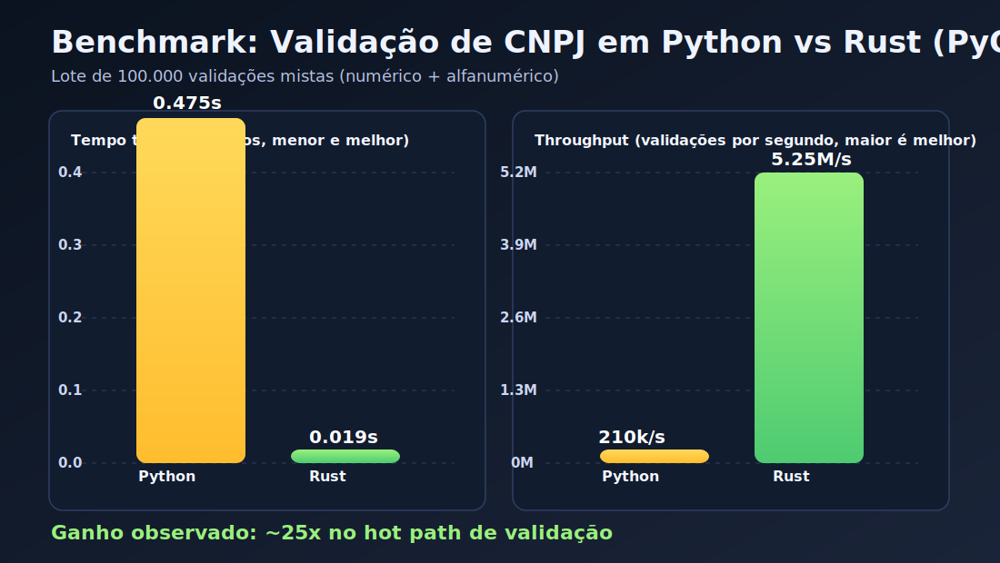

# CNPJ Alfanumérico na prática: Rust acelerando Python em uma regra fiscal crítica
###### Por [@zejuniortdr](https://github.com/zejuniortdr/) em Jun 19, 2026

A partir de julho de 2026, o ecossistema brasileiro passa a conviver com o CNPJ alfanumérico (IN RFB 2.119/2022). Para quem opera sistemas de cadastro, antifraude, onboarding, faturamento e compliance, isso muda o jogo: validações que antes eram simples e numéricas agora precisam aceitar letras, manter compatibilidade retroativa e continuar performando sob alta carga.

Neste post, vamos para o modo hands-on usando o projeto `rsfn4py`: a regra de validação de CNPJ fica em Rust e é exposta para Python via PyO3. A ideia não é trocar sua stack inteira, e sim turbinar o trecho mais crítico com custo de migração muito baixo.

## O problema real

Em muitas aplicações Python, validar CNPJ parece barato até virar gargalo. O cenário piora quando:

1. A validação acontece em lote (ETL, filas, conciliação, processamento massivo).
2. A regra passa a aceitar alfanumérico e exige normalização mais robusta.
3. O sistema precisa manter baixa latência em APIs e jobs simultâneos.

A pergunta certa deixa de ser "Python ou Rust?" e vira "onde Rust melhora meu throughput sem reescrever tudo?".

## Hands-on em 5 minutos

### 1. Build local do módulo Rust para Python

```bash
cd rsfn4py
python -m venv .venv
source .venv/bin/activate
pip install -U pip maturin pytest
maturin develop --release
```

### 2. Rode os testes de compatibilidade

```bash
pytest -v tests/
```

Os testes cobrem CNPJ numérico, CNPJ alfanumérico, DV incorreto, repetição e entradas inválidas.


### 3. Como ficou o core

No `rsfn4py`, o algoritmo da validação fica no core em Rust:

```rust
#[pyfunction]
fn validate_cnpj_rust(cnpj: &str) -> bool {
    let cleaned: Vec<char> = cnpj.chars()
        .filter(|c| c.is_ascii_alphanumeric())
        .map(|c| c.to_ascii_uppercase())
        .collect();

    if cleaned.len() != 14 {
        return false;
    }

    if cleaned.iter().all(|&c| c == cleaned[0]) {
        return false;
    }

    let get_val = |c: char| -> i32 { c as i32 - 48 };

    let weights1 = [5, 4, 3, 2, 9, 8, 7, 6, 5, 4, 3, 2];
    let mut sum1 = 0;
    for i in 0..12 {
        sum1 += get_val(cleaned[i]) * weights1[i];
    }
    let mod1 = sum1 % 11;
    let dv1 = if mod1 < 2 { 0 } else { 11 - mod1 };

    if get_val(cleaned[12]) != dv1 {
        return false;
    }

    let weights2 = [6, 5, 4, 3, 2, 9, 8, 7, 6, 5, 4, 3, 2];
    let mut sum2 = 0;
    for i in 0..13 {
        sum2 += get_val(cleaned[i]) * weights2[i];
    }
    let mod2 = sum2 % 11;
    let dv2 = if mod2 < 2 { 0 } else { 11 - mod2 };

    get_val(cleaned[13]) == dv2
}
```

E o Python continua sendo a camada de integração e produtividade:

```python
from rsfn4py import validate_cnpj_rust, validate_cnpj_python

casos = [
    "12.345.678/0001-95",
    "12ABC34501DE35",
    "11.111.111/1111-11",
]

for cnpj in casos:
    print(cnpj, validate_cnpj_rust(cnpj))
```

Esse formato entrega o melhor dos dois mundos:

1. Python continua no fluxo principal do produto.
2. Rust assume o trecho matemático e intensivo em CPU.
3. O pacote sobe como dependência comum (wheel), sem dor para o time da aplicação.

## Benchmark: onde o ganho aparece

Nos testes documentados no projeto, com 100.000 validações mistas (formatadas, sem formatação e alfanuméricas), o resultado foi:

| Linguagem | Tempo de execução | Validações por segundo |
| --- | --- | --- |
| Python puro | ~0,475s | ~210.000/s |
| Rust (PyO3) | ~0,019s | ~5.250.000/s |



Isso representa um ganho de aproximadamente **25x** para o núcleo em Rust.

Em PoCs locais (como o script de benchmark com 50.000 iterações), a proporção também se mantém alta, mesmo variando por hardware, versão de Python e flags de compilação.

## Por que funciona tão bem?

1. Compilação nativa: o código crítico roda como binário otimizado, sem custo de interpretação por iteração.
2. Menos overhead no hot path: loops, soma ponderada e checagem de DV ficam em uma rotina enxuta.
3. Fronteira clara entre linguagens: Python orquestra, Rust calcula.

Em termos práticos: quando a regra fiscal vira "hot path", esse padrão evita escalar infraestrutura apenas para compensar CPU em validação.

## Compatibilidade com legado e com o novo formato

O mesmo pacote cobre:

1. CNPJ tradicional numérico.
2. CNPJ alfanumérico no formato novo.
3. Entradas com pontuação (limpeza antes do cálculo).
4. Casos inválidos clássicos (DV errado, repetição, lixo textual).

Essa compatibilidade reduz risco de regressão durante a janela de transição regulatória.

## Checklist de adoção em produção

1. Coloque a validação Rust atrás de feature flag no início.
2. Rode as duas implementações em paralelo por um período para comparar outputs.
3. Monitore latência P95/P99 no endpoint que usa validação.
4. Mantenha fallback Python para rollback rápido.

## O que este caso ensina sobre o ecossistema Rust fora do Rust

A grande mensagem não é "abandone Python". É "use Rust como acelerador estratégico".

Para times de produto, isso significa:

1. Entregar melhoria de performance sem reescrever serviço inteiro.
2. Preservar stack e produtividade do ecossistema Python.
3. Ganhar previsibilidade para escalar regras de negócio críticas.

No contexto de CNPJ alfanumérico, é um ótimo exemplo de como Rust deixa de ser apenas linguagem de sistema e vira componente de alto impacto em stacks já consolidadas.

## Próximos passos

Se você quiser aplicar esse modelo no seu contexto:

1. Identifique funções CPU-bound no seu pipeline Python.
2. Extraia o núcleo em Rust com PyO3 e exponha API mínima.
3. Meça antes/depois com dados reais de produção.
4. Publique wheel para reduzir atrito de adoção no time.

Quando o assunto é regra fiscal crítica em alto volume, performance deixa de ser "otimização" e vira requisito de negócio. E, nesse ponto, Rust como extensão do Python faz muita diferença.
