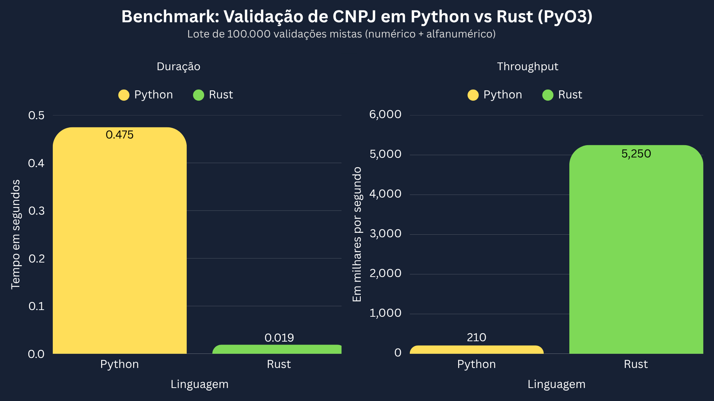

# CNPJ alfanumérico e CPF na prática: Rust acelerando Python em regras fiscais críticas
###### Por [@zejuniortdr](https://github.com/zejuniortdr/) em Jun 19, 2026

A partir de julho de 2026, o ecossistema brasileiro passa a conviver com o CNPJ alfanumérico (IN RFB 2.119/2022). Para quem opera sistemas de cadastro, antifraude, onboarding, faturamento e compliance, isso muda o jogo: validações que antes eram simples e numéricas agora precisam aceitar letras, manter compatibilidade retroativa e continuar performando sob alta carga.

Neste post, vamos para o modo hands-on usando o projeto `rsfn4py`: as regras de validação de CNPJ e CPF ficam em Rust e são expostas para Python via PyO3, com fallback em Python puro. A ideia não é trocar sua stack inteira, e sim turbinar o trecho mais crítico com custo de migração muito baixo.

## O problema real

Em muitas aplicações Python, validar documento fiscal parece barato até virar gargalo. O cenário piora quando:

1. A validação acontece em lote (ETL, filas, conciliação, processamento massivo).
2. A regra passa a aceitar alfanumérico (no CNPJ) e exige normalização mais robusta.
3. O sistema precisa manter baixa latência em APIs e jobs simultâneos.

A pergunta certa deixa de ser "Python ou Rust?" e vira "onde Rust melhora meu throughput sem reescrever tudo?".

## Hands-on em 5 minutos

### 1. Build local do módulo Rust para Python

```bash
cd rsfn4py
python -m venv .venv
source .venv/bin/activate
pip install -U pip maturin pytest
maturin develop --release
```

### 2. Rode os testes de compatibilidade

```bash
pytest -v tests/
```

Os testes cobrem CNPJ numérico e alfanumérico, CPF com e sem formatação, DV incorreto, repetição e entradas inválidas.

---

## Incorporando em um projeto Python existente via PyPI

Se você não quer clonar o repositório e apenas precisa da validação de alta performance no seu projeto, basta instalar o pacote publicado:

```bash
pip install rsfn4py
```

O pacote distribui wheels pré-compilados para Linux, macOS e Windows nas versões mais recentes do Python, então **não é necessário ter Rust instalado** na máquina.

### Uso básico

```python
from rsfn4py import validate_cnpj_rust, validate_cpf_rust

cnpjs = [
    "12.345.678/0001-95",   # Numérico formatado
    "12345678000195",        # Numérico sem formatação
    "12ABC34501DE35",        # Alfanumérico (novo formato)
    "11.111.111/1111-11",   # Inválido (sequência repetida)
]

for cnpj in cnpjs:
    status = "✅ válido" if validate_cnpj_rust(cnpj) else "❌ inválido"
    print(f"{cnpj:<25} → {status}")

cpfs = [
    "529.982.247-25",       # CPF válido formatado
    "52998224725",          # CPF válido sem formatação
    "529.982.247-24",       # DV incorreto
    "111.111.111-11",       # Inválido (repetição)
]

for cpf in cpfs:
    status = "✅ válido" if validate_cpf_rust(cpf) else "❌ inválido"
    print(f"{cpf:<25} → {status}")
```

### Em um endpoint FastAPI

```python
from fastapi import FastAPI, HTTPException
from rsfn4py import validate_cnpj_rust, validate_cpf_rust

app = FastAPI()

@app.get("/cadastro/cnpj/{cnpj}")
def validar_cnpj(cnpj: str):
    if not validate_cnpj_rust(cnpj):
        raise HTTPException(status_code=422, detail="CNPJ inválido")
    return {"tipo": "cnpj", "documento": cnpj, "valido": True}


@app.get("/cadastro/cpf/{cpf}")
def validar_cpf(cpf: str):
    if not validate_cpf_rust(cpf):
        raise HTTPException(status_code=422, detail="CPF inválido")
    return {"tipo": "cpf", "documento": cpf, "valido": True}
```

### Em processamento em lote (pandas/polars)

```python
import pandas as pd
from rsfn4py import validate_cnpj_rust, validate_cpf_rust

df = pd.read_csv("cadastros.csv")

# Aplica a validação Rust em todo o DataFrame — sem loop Python explícito
df["cnpj_valido"] = df["cnpj"].apply(validate_cnpj_rust)
df["cpf_valido"] = df["cpf"].apply(validate_cpf_rust)

invalidos_cnpj = df[~df["cnpj_valido"]]
invalidos_cpf = df[~df["cpf_valido"]]
print(f"{len(invalidos_cnpj)} CNPJs inválidos encontrados")
print(f"{len(invalidos_cpf)} CPFs inválidos encontrados")
```

> **Nota:** Como `validate_cnpj_rust` e `validate_cpf_rust` são funções C-Extension, o overhead por chamada é muito menor do que uma função Python pura, o que faz diferença especialmente em DataFrames com centenas de milhares de linhas.

---

### 4. Como ficou o core

No `rsfn4py`, os algoritmos de validação ficam no core em Rust:

```rust
#[pyfunction]
fn validate_cnpj_rust(cnpj: &str) -> bool {
    let cleaned: Vec<char> = cnpj.chars()
        .filter(|c| c.is_ascii_alphanumeric())
        .map(|c| c.to_ascii_uppercase())
        .collect();

    if cleaned.len() != 14 {
        return false;
    }

    if cleaned.iter().all(|&c| c == cleaned[0]) {
        return false;
    }

    let get_val = |c: char| -> i32 { c as i32 - 48 };

    let weights1 = [5, 4, 3, 2, 9, 8, 7, 6, 5, 4, 3, 2];
    let mut sum1 = 0;
    for i in 0..12 {
        sum1 += get_val(cleaned[i]) * weights1[i];
    }
    let mod1 = sum1 % 11;
    let dv1 = if mod1 < 2 { 0 } else { 11 - mod1 };

    if get_val(cleaned[12]) != dv1 {
        return false;
    }

    let weights2 = [6, 5, 4, 3, 2, 9, 8, 7, 6, 5, 4, 3, 2];
    let mut sum2 = 0;
    for i in 0..13 {
        sum2 += get_val(cleaned[i]) * weights2[i];
    }
    let mod2 = sum2 % 11;
    let dv2 = if mod2 < 2 { 0 } else { 11 - mod2 };

    get_val(cleaned[13]) == dv2
}

#[pyfunction]
fn validate_cpf_rust(cpf: &str) -> bool {
    let cleaned: Vec<char> = cpf.chars().filter(|c| c.is_ascii_digit()).collect();

    if cleaned.len() != 11 {
        return false;
    }

    if cleaned.iter().all(|&c| c == cleaned[0]) {
        return false;
    }

    let get_val = |c: char| -> i32 { c as i32 - 48 };

    let mut sum1 = 0;
    for i in 0..9 {
        sum1 += get_val(cleaned[i]) * (10 - i as i32);
    }
    let mod1 = sum1 % 11;
    let dv1 = if mod1 < 2 { 0 } else { 11 - mod1 };

    if get_val(cleaned[9]) != dv1 {
        return false;
    }

    let mut sum2 = 0;
    for i in 0..10 {
        sum2 += get_val(cleaned[i]) * (11 - i as i32);
    }
    let mod2 = sum2 % 11;
    let dv2 = if mod2 < 2 { 0 } else { 11 - mod2 };

    get_val(cleaned[10]) == dv2
}
```

E o Python continua sendo a camada de integração e produtividade:

```python
from rsfn4py import (
    validate_cnpj_rust,
    validate_cnpj_python,
    validate_cpf_rust,
    validate_cpf_python,
)

casos = [
    "12.345.678/0001-95",
    "12ABC34501DE35",
    "11.111.111/1111-11",
]

for cnpj in casos:
    print(cnpj, validate_cnpj_rust(cnpj))

cpfs = [
    "529.982.247-25",
    "52998224725",
    "111.111.111-11",
]

for cpf in cpfs:
    print(cpf, validate_cpf_rust(cpf))
```

Esse formato entrega o melhor dos dois mundos:

1. Python continua no fluxo principal do produto.
2. Rust assume o trecho matemático e intensivo em CPU.
3. O pacote sobe como dependência comum (wheel), sem dor para o time da aplicação.

## Benchmark: onde o ganho aparece

Nos testes documentados no projeto, com 100.000 validações mistas de CNPJ (formatadas, sem formatação e alfanuméricas), o resultado foi:

| Linguagem | Tempo de execução | Validações por segundo |
| --- | --- | --- |
| Python puro | ~0,475s | ~210.000/s |
| Rust (PyO3) | ~0,019s | ~5.250.000/s |



Isso representa um ganho de aproximadamente **25x** para o núcleo em Rust.

A proporção também se mantém alta em testes com volumes menores, mesmo variando por hardware, versão de Python e flags de compilação.

## Por que funciona tão bem?

1. Compilação nativa: o código crítico roda como binário otimizado, sem custo de interpretação por iteração.
2. Menos overhead no hot path: loops, soma ponderada e checagem de DV ficam em uma rotina enxuta.
3. Fronteira clara entre linguagens: Python orquestra, Rust calcula.

Em termos práticos: quando a regra fiscal vira "hot path", esse padrão evita escalar infraestrutura apenas para compensar CPU em validação.

## Compatibilidade com legado e com o novo formato

O mesmo pacote cobre:

1. CNPJ tradicional numérico.
2. CNPJ alfanumérico no formato novo.
3. CPF tradicional com e sem máscara.
4. Entradas com pontuação e caracteres extras (limpeza antes do cálculo).
5. Casos inválidos clássicos (DV errado, repetição, lixo textual).

Essa compatibilidade reduz risco de regressão durante a janela de transição regulatória.

## Checklist de adoção em produção

1. Coloque a validação Rust atrás de feature flag no início.
2. Rode as duas implementações em paralelo por um período para comparar outputs.
3. Monitore latência P95/P99 no endpoint que usa validação.
4. Mantenha fallback Python para rollback rápido.

## O que este caso ensina sobre o ecossistema Rust fora do Rust

A grande mensagem não é "abandone Python". É "use Rust como acelerador estratégico".

Para times de produto, isso significa:

1. Entregar melhoria de performance sem reescrever serviço inteiro.
2. Preservar stack e produtividade do ecossistema Python.
3. Ganhar previsibilidade para escalar regras de negócio críticas.

No contexto de CNPJ alfanumérico e CPF em alto volume, é um ótimo exemplo de como Rust deixa de ser apenas linguagem de sistema e vira componente de alto impacto em stacks já consolidadas.

## Próximos passos

Se você quiser aplicar esse modelo no seu contexto:

1. Identifique funções CPU-bound no seu pipeline Python.
2. Extraia o núcleo em Rust com PyO3 e exponha API mínima.
3. Meça antes/depois com dados reais de produção.
4. Publique wheel para reduzir atrito de adoção no time.

Quando o assunto é regra fiscal crítica em alto volume, performance deixa de ser "otimização" e vira requisito de negócio. E, nesse ponto, Rust como extensão do Python faz muita diferença.
