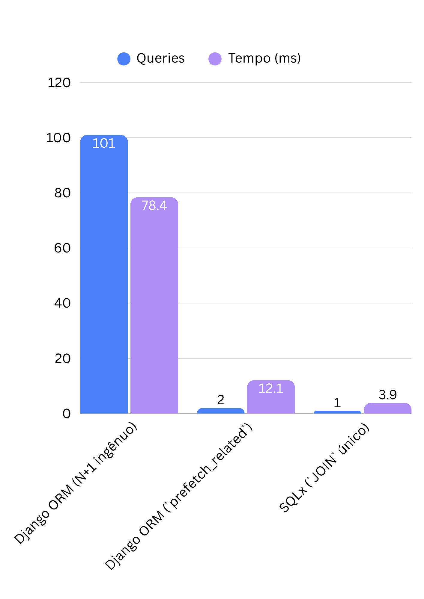

# Seu ORM está mentindo para você (Parte II): o N+1 que o SQLx te obriga a enxergar
###### Por [@zejuniortdr](https://github.com/zejuniortdr/) em Jul 06, 2026


No [post sobre Django ORM vs SQLx](../0004-django-orm-vs-sqlx) eu defendi uma ideia incômoda: a "mágica" do ORM tem um preço, e quase sempre quem paga é o seu banco de dados em produção. Recebi muita mensagem concordando — e algumas dizendo que eu estava sendo injusto com o ORM.

Então vamos para o caso mais concreto possível dessa mágica cobrando a conta: o **problema N+1**. Ele é tão comum que provavelmente está acontecendo agora em alguma rota da sua aplicação, silencioso, escondido por uma linha de código que parece inofensiva.

## O problema real

Imagine uma API que lista autores e os livros de cada um. Em Django, o código sai dos dedos quase sozinho:

```python
# views.py
from django.http import JsonResponse
from .models import Autor

def listar_autores(request):
    autores = Autor.objects.all()
    data = []
    for autor in autores:
        data.append({
            "nome": autor.nome,
            "livros": [livro.titulo for livro in autor.livros.all()],
        })
    return JsonResponse({"autores": data})
```

Esse código está **correto**. Ele roda, passa no teste, vai para produção. E é exatamente aí que mora a mentira.

## A mentira: uma query que virou cento e uma

Ative o log de SQL do Django e olhe o que aquele `for` inocente produziu com 100 autores:

```sql
-- 1 query para buscar os autores
SELECT id, nome FROM autores;

-- depois, UMA query por autor para buscar os livros (100 queries!)
SELECT id, titulo FROM livros WHERE autor_id = 1;
SELECT id, titulo FROM livros WHERE autor_id = 2;
SELECT id, titulo FROM livros WHERE autor_id = 3;
-- ... e assim por diante, até o autor 100
```

São **1 + N** queries: uma para a lista e mais uma para cada item dela. Com 100 autores, são 101 idas ao banco. Com 10.000 autores, são 10.001. O ORM nunca te avisou disso — o `autor.livros.all()` parece um simples acesso a atributo, mas cada chamada abre uma conexão, faz round-trip de rede, espera o banco responder e desserializa o resultado.

> O N+1 raramente aparece em desenvolvimento, onde a tabela tem 10 linhas. Ele explode em produção, quando os dados crescem e a latência de rede entre app e banco entra na conta. É o bug de performance mais democrático que existe.

## Como o SQLx te obriga a ver

A grande diferença filosófica do SQLx não é ser "mais rápido". É que ele **não te deixa fingir que o banco não existe**. Você escreve SQL. E quando você escreve SQL, escrever 100 queries num loop dá trabalho — o caminho natural é o caminho certo: um `JOIN`.

```rust
use sqlx::PgPool;

#[derive(serde::Serialize)]
struct AutorComLivros {
    nome: String,
    livros: Vec<String>,
}

async fn listar_autores(pool: &PgPool) -> Result<Vec<AutorComLivros>, sqlx::Error> {
    // UMA query. O banco faz o trabalho que ele foi feito para fazer.
    let linhas = sqlx::query!(
        r#"
        SELECT a.id, a.nome, l.titulo
        FROM autores a
        LEFT JOIN livros l ON l.autor_id = a.id
        ORDER BY a.id
        "#
    )
    .fetch_all(pool)
    .await?;

    // Agrupa em memória, em Rust, sem tocar no banco de novo.
    let mut mapa: indexmap::IndexMap<i32, AutorComLivros> = indexmap::IndexMap::new();
    for linha in linhas {
        let entrada = mapa.entry(linha.id).or_insert_with(|| AutorComLivros {
            nome: linha.nome.clone(),
            livros: Vec::new(),
        });
        if let Some(titulo) = linha.titulo {
            entrada.livros.push(titulo);
        }
    }

    Ok(mapa.into_values().collect())
}
```

Repare: não existe um caminho "preguiçoso" aqui que silenciosamente vire 100 queries. Para acessar os livros, você teve que decidir, na hora de escrever o SQL, como buscá-los. O custo é **visível na fonte do código** — e custo visível é custo que você otimiza.

## O ORM tem a saída de emergência — se você souber que precisa dela

Em defesa do Django: ele resolve o N+1. Basta uma palavra:

```python
# Agora são 2 queries no total, não importa quantos autores existam
autores = Autor.objects.prefetch_related("livros").all()
```

O `prefetch_related` faz o Django buscar todos os livros numa segunda query e juntar em memória. O `select_related` faz algo parecido com `JOIN` para relações `ForeignKey`/`OneToOne`. Funciona muito bem.

O problema não é a ausência de solução. É que **a solução é opt-in e invisível**. O código errado e o código certo têm a mesma cara — a única diferença é uma chamada de método que você precisa lembrar de adicionar. Esqueceu? Nenhum erro, nenhum aviso. Só uma rota lenta que ninguém entende seis meses depois.

No SQLx, o "esquecimento" não existe: você não consegue escrever a query sem decidir o que buscar.

## Benchmark: a conta da mentira

Rota retornando **100 autores com ~10 livros cada**, banco PostgreSQL com ~0,4ms de latência de round-trip (cenário realista de app e banco em redes diferentes):

**Tempo de resposta da rota**

| Abordagem | Queries | Tempo |
| --- | ---: | ---: |
| Django ORM (N+1 ingênuo) | 101 | 78,4ms |
| Django ORM (`prefetch_related`) | 2 | 12,1ms |
| SQLx (`JOIN` único) | 1 | **3,9ms** |



**Speedup sobre o N+1 ingênuo**

| Abordagem | Ganho |
| --- | ---: |
| `prefetch_related` | 6,5x |
| SQLx `JOIN` | **20,1x** |

Os números variam por latência de rede, tamanho do dataset e índices, mas o formato da curva é sempre o mesmo: o N+1 escala com o número de linhas, as outras duas abordagens não. Em 10.000 autores, a diferença deixa de ser de milissegundos e vira de segundos.

## Por que isso importa além do benchmark

1. **Round-trip de rede domina.** A query em si é rápida; o caro é o ir-e-voltar até o banco. N+1 multiplica justamente a parte cara.
2. **O ORM otimiza para escrita de código, não para leitura do banco.** Isso é ótimo para produtividade e péssimo quando o custo fica escondido.
3. **Custo visível é custo gerenciável.** Quando você é forçado a escrever a query, você é forçado a pensar nela.

A tese da Parte I se confirma aqui: **abstração que esconde custo é dívida disfarçada de produtividade.** Você pega o empréstimo na hora de escrever e paga os juros em produção.

## Contraponto honesto

Não é para você sair jogando seu ORM no lixo — eu mesmo não jogaria:

1. Para CRUD comum, ORM entrega velocidade de desenvolvimento que SQL puro não encosta.
2. O N+1 tem solução trivial **quando você sabe que ele existe** — e agora você sabe.
3. Migrations, validações e o ecossistema do Django ORM são um valor real e enorme.

A pergunta certa não é "ORM ou SQL?". É "eu sei o que meu ORM está fazendo com o meu banco?". Se a resposta for não, o problema não é a ferramenta — é a mágica.

## Checklist anti-N+1 em produção

1. Ligue o log de SQL em ambiente de staging e **conte as queries** das suas rotas mais quentes.
2. Use o `django-debug-toolbar` (ou `nplusone`) para capturar N+1 automaticamente.
3. Adote `prefetch_related`/`select_related` por padrão em qualquer rota que itere sobre relações.
4. Defina um teto de queries por request em teste (ex.: `assertNumQueries`) para travar regressões.
5. Para os hot paths mais críticos, considere descer para SQL explícito — onde o custo nunca mais se esconde.

## O que esse caso ensina

O ORM não é o vilão. O vilão é o custo invisível. Rust e o SQLx não são mágicos — eles são o oposto da mágica, e é exatamente por isso que te protegem: o que você não consegue esconder, você não esquece de otimizar.

No próximo post dessa pegada, eu vou ainda mais longe e mostro o que acontece quando você decide que nem o seu worker de tarefas precisa mais ser Python. 

---

Quer se aprofundar em Rust de forma prática, aplicada ao mundo real e com foco em performance? Conheça o livro em [desbravandorust.com.br](https://desbravandorust.com.br).
