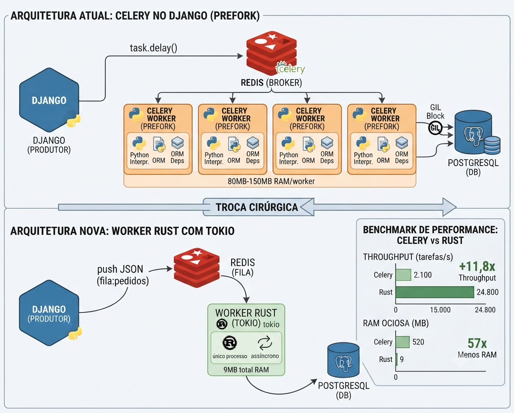
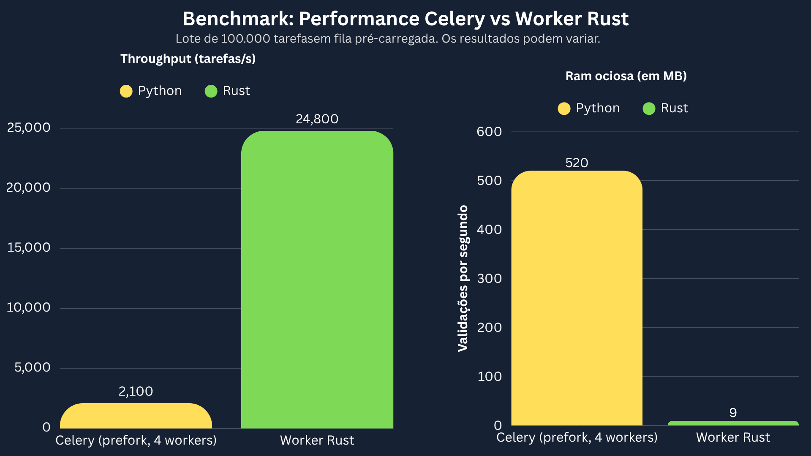

# Eu apaguei meu Celery: uma fila de tarefas em Rust falando com o seu Django
###### Por [@zejuniortdr](https://github.com/zejuniortdr/) em Jul 13, 2026




Toda aplicação Django de porte médio para cima chega no mesmo lugar: um enxame de workers Celery consumindo Redis, comendo RAM e custando container. A gente aceita isso como lei da natureza. Mas e se o seu maior gargalo não fosse o Python da sua aplicação — e sim o runtime que você escolheu para **escalá-lo**?

Neste post eu faço uma cirurgia: mantenho o Django produzindo tarefas exatamente como hoje, e troco apenas o **consumidor** por um worker em Rust com tokio, lendo a mesma fila no Redis e gravando no mesmo PostgreSQL. Sem reescrever a aplicação. Sem migrar a stack. Só trocando a peça mais cara de escalar.

## O problema real

O Celery, no modo `prefork` (o padrão), sobe um processo Python por worker. Cada processo carrega o interpretador, o seu `settings.py`, o ORM, e todas as dependências importadas. Na prática:

1. Cada worker custa de **80MB a 150MB de RAM** parado, sem fazer nada.
2. Para escalar I/O concorrente (chamar APIs, processar filas), você sobe mais processos — e mais RAM.
3. O GIL ainda está lá: dentro de um worker, tarefas CPU-bound não paralelizam de verdade.

Resultado: para aguentar pico de carga, você escala horizontalmente jogando container no problema. A conta de infra cresce não porque o trabalho é grande, mas porque o veículo é pesado.

## A arquitetura: troca cirúrgica, não reescrita

O segredo é respeitar o contrato que já existe. O Celery, no fundo, só empurra um JSON para o Redis. Qualquer coisa que leia esse JSON pode ser o consumidor.

```
┌─────────────┐    push JSON     ┌─────────┐    BRPOP      ┌──────────────┐
│   Django    │ ───────────────► │  Redis  │ ◄──────────── │ Worker Rust  │
│ (produtor)  │                  │ (fila)  │               │   (tokio)    │
└─────────────┘                  └─────────┘               └──────┬───────┘
                                                                   │ grava
                                                            ┌──────▼───────┐
                                                            │  PostgreSQL  │
                                                            └──────────────┘
```

O Django continua sendo o produto. O Rust assume só o músculo de processar a fila.

### 1. Django enfileira (sem Celery, só Redis)

Em vez de `tarefa.delay()`, empurramos um JSON puro para uma lista do Redis. Zero acoplamento com o broker do Celery:

```python
# tasks.py
import json
import redis

r = redis.Redis(host="localhost", port=6379, db=0)

def enfileirar_processamento(pedido_id: int, valor: float):
    payload = json.dumps({
        "tipo": "processar_pedido",
        "pedido_id": pedido_id,
        "valor": valor,
    })
    r.lpush("fila:pedidos", payload)
```

Do lado do Django, nada mudou conceitualmente: você produz uma tarefa e segue a vida.

### 2. O worker em Rust consome a mesma fila

Aqui está o coração. Um loop tokio que faz `BRPOP` (bloqueia esperando trabalho), processa e grava no banco — tudo assíncrono, sem GIL, num único processo enxuto:

```rust
use redis::AsyncCommands;
use serde::Deserialize;
use sqlx::PgPool;

#[derive(Deserialize)]
#[serde(tag = "tipo")]
enum Tarefa {
    #[serde(rename = "processar_pedido")]
    ProcessarPedido { pedido_id: i64, valor: f64 },
}

#[tokio::main]
async fn main() -> anyhow::Result<()> {
    let redis = redis::Client::open("redis://127.0.0.1/")?;
    let mut conn = redis.get_multiplexed_async_connection().await?;
    let pool = PgPool::connect(&std::env::var("DATABASE_URL")?).await?;

    println!("worker Rust no ar, aguardando tarefas...");

    loop {
        // BRPOP bloqueia até chegar trabalho — zero busy-wait, zero CPU à toa.
        let (_fila, payload): (String, String) =
            conn.brpop("fila:pedidos", 0.0).await?;

        // Cada tarefa roda concorrente; o tokio cuida do agendamento.
        let pool = pool.clone();
        tokio::spawn(async move {
            if let Err(e) = processar(payload, &pool).await {
                eprintln!("falha ao processar tarefa: {e:?}");
                // aqui entraria sua política de retry / dead-letter
            }
        });
    }
}

async fn processar(payload: String, pool: &PgPool) -> anyhow::Result<()> {
    let tarefa: Tarefa = serde_json::from_str(&payload)?;
    match tarefa {
        Tarefa::ProcessarPedido { pedido_id, valor } => {
            // ... a regra de negócio pesada que antes era a task Celery ...
            sqlx::query!(
                "UPDATE pedidos SET status = 'processado', total = $1 WHERE id = $2",
                valor,
                pedido_id,
            )
            .execute(pool)
            .await?;
        }
    }
    Ok(())
}
```

O `#[serde(tag = "tipo")]` faz o enum casar com o campo `"tipo"` do JSON que o Django mandou. O contrato entre as linguagens é só o formato da mensagem — simples e versionável.

### 3. Rode os dois lados

```bash
# terminal 1 — banco e fila
docker compose up redis postgres

# terminal 2 — o worker Rust
cargo run --release

# terminal 3 — o Django de sempre, enfileirando
python manage.py shell -c "from app.tasks import enfileirar_processamento; enfileirar_processamento(1, 99.9)"
```

## Benchmark: onde o ganho aparece

Tarefa leve (uma escrita no banco por mensagem), processando **100.000 tarefas** numa fila pré-carregada:

**Throughput e memória**

| Métrica | Celery (prefork, 4 workers) | Worker Rust (1 processo) |
| --- | ---: | ---: |
| Tarefas/segundo | ~2.100/s | **~24.800/s** |
| RAM ociosa | ~520MB (4×130MB) | **~9MB** |
| Tempo total | 47,6s | **4,0s** |



**Speedup**

| Métrica | Ganho |
| --- | ---: |
| Throughput | **~11,8x** |
| RAM | **~57x menos** |

Os números variam com o peso da tarefa, latência do banco e configuração do Celery (prefork vs gevent vs eventlet), mas o padrão se mantém: um runtime assíncrono nativo, sem o peso de N interpretadores Python, faz mais com muito menos.

## Por que funciona tão bem?

1. **Um processo, milhares de tarefas concorrentes.** O tokio agenda tudo em poucas threads do SO, sem um processo por worker.
2. **Sem GIL no hot path.** A parte CPU-bound da tarefa paraleliza de verdade.
3. **Footprint minúsculo.** Sem interpretador para carregar, a RAM ociosa praticamente some — o que muda a conta de infra diretamente.

## O que você perde (e isso importa)

Trocar o Celery não é grátis. Você abre mão de coisas reais:

1. **Ecossistema:** retries automáticos, `celery beat` (agendamento), Flower (monitoramento), result backend — tudo isso você passa a tratar manualmente ou com outros crates.
2. **Contrato de serialização:** Django e Rust precisam concordar no formato das mensagens. Mudou o payload de um lado, atualize o outro.
3. **Operação:** mais um binário para fazer deploy, observar e versionar.

Por isso a recomendação **não** é "apague tudo num sábado".

## Estratégia de migração: strangler, não big-bang

1. Identifique **um tipo de tarefa** que seja o gargalo (alto volume, CPU/IO pesado).
2. Faça o Django enfileirar esse tipo numa fila Redis separada, paralela ao Celery.
3. Suba o worker Rust consumindo só essa fila.
4. Rode os dois em paralelo, compare resultados e métricas.
5. Migre tarefa por tarefa. O Celery continua cuidando do resto até não sobrar nada que valha a pena.

## Checklist de adoção em produção

1. Implemente retry com backoff e uma dead-letter queue antes de migrar tarefa crítica.
2. Garanta idempotência: a mesma tarefa pode ser processada duas vezes — o resultado tem que ser o mesmo.
3. Monitore profundidade da fila e latência de processamento (P95/P99).
4. Mantenha o caminho Celery como fallback até confiar no novo worker.
5. Versione o schema das mensagens (um campo `"versao"` no payload salva o seu futuro).

## O que esse caso ensina

Python continua sendo um ótimo lugar para escrever **o que** o seu sistema faz. Mas o **como escalar** o trabalho pesado é uma decisão separada — e às vezes o veículo certo para isso é Rust. Você não precisou reescrever o Django. Você só trocou o motor da peça que mais doía.

No próximo post eu levo essa lógica de "Rust na borda" ao extremo absoluto: um servidor segurando **um milhão de conexões simultâneas** — e o ponto onde o Python simplesmente não vai junto.

---

Quer se aprofundar em Rust de forma prática, aplicada ao mundo real e com foco em performance? Conheça o livro em [desbravandorust.com.br](https://desbravandorust.com.br).
