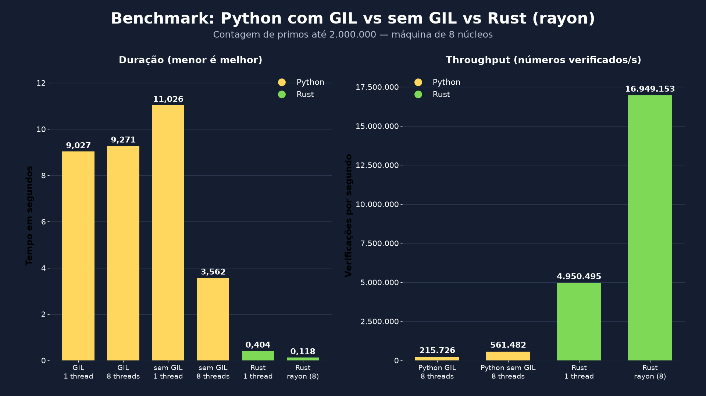

# Python sem GIL chegou. Rust ainda importa?
###### Por [@zejuniortdr](https://github.com/zejuniortdr/) em Ago 03, 2026


Por mais de trinta anos, toda conversa sobre performance em Python esbarrou na mesma sigla: **GIL**. O Global Interpreter Lock — o cadeado global que impede duas threads de executarem bytecode Python ao mesmo tempo — foi o vilão oficial de todo benchmark, a desculpa universal para "Python não paraleliza", e o motivo pelo qual este blog existe.

Só que o vilão caiu. O Python 3.13 estreou o modo **free-threading** como experimento, e no 3.14 ele virou **oficialmente suportado** (PEP 779). Hoje você instala um interpretador sem GIL com um comando e suas threads finalmente rodam em paralelo de verdade, em todos os núcleos.

Então a pergunta que me fizeram — e que merece resposta honesta, com benchmark real e números que rodaram na minha máquina enquanto eu escrevia este post — é: **se o Python paraleliza de verdade agora, o Rust ainda importa?**

Spoiler: importa. Mas não pelo motivo que você imagina. E o free-threading é uma notícia **excelente** — inclusive para quem usa Rust.

## O problema real

Vamos relembrar o que o GIL faz com um trabalho CPU-bound. Você tem 8 núcleos, sobe 8 threads, e espera o trabalho terminar 8x mais rápido. Com GIL, as 8 threads revezam o mesmo cadeado: **uma executa, sete esperam**. O resultado é paralelismo de mentira — e às vezes até mais lento que single-thread, pelo custo de disputa do lock.

A resposta clássica era `multiprocessing`: subir processos em vez de threads. Funciona, mas cada processo carrega seu interpretador, sua cópia dos dados (ou o custo de serializar tudo via pickle para atravessar a fronteira), e a RAM escala junto. É o mesmo padrão do worker Celery: escalar jogando processo no problema.

O free-threading remove o cadeado. As threads compartilham memória e executam simultaneamente. A promessa é: **paralelismo real sem mudar seu código**.

Vamos medir o quanto dessa promessa se cumpre — e onde fica o teto dela.

## O experimento: mesmo trabalho, quatro configurações

O trabalho é deliberadamente CPU-bound e sem I/O: contar quantos primos existem abaixo de 2.000.000, por divisão por tentativa. É o tipo de carga que não tem onde se esconder — ou o núcleo trabalha, ou não trabalha.

As quatro configurações:

1. **Python 3.14 (build padrão, com GIL)** — single-thread e 8 threads.
2. **Python 3.14t (free-threading, sem GIL)** — o mesmo código, single-thread e 8 threads.
3. **Rust single-thread**.
4. **Rust com rayon** — paralelismo em 8 núcleos.

### O código Python (idêntico nos dois builds)

```python
# bench.py
import sys
import time
from concurrent.futures import ThreadPoolExecutor

LIMIT = 2_000_000
WORKERS = 8


def is_prime(n: int) -> bool:
    if n < 2:
        return False
    if n % 2 == 0:
        return n == 2
    i = 3
    while i * i <= n:
        if n % i == 0:
            return False
        i += 2
    return True


def count_primes(start: int, end: int) -> int:
    return sum(1 for n in range(start, end) if is_prime(n))


def run_threads(workers: int) -> int:
    chunk = LIMIT // workers
    ranges = [
        (i * chunk, (i + 1) * chunk if i < workers - 1 else LIMIT)
        for i in range(workers)
    ]
    with ThreadPoolExecutor(max_workers=workers) as ex:
        return sum(ex.map(lambda r: count_primes(*r), ranges))


def main():
    gil = sys._is_gil_enabled()
    print(f"Python {sys.version.split()[0]} {'com GIL' if gil else 'sem GIL'}")

    t0 = time.perf_counter()
    total = count_primes(2, LIMIT)
    print(f"single-thread: {time.perf_counter() - t0:.3f}s (primos={total})")

    t0 = time.perf_counter()
    total = run_threads(WORKERS)
    print(f"{WORKERS} threads:     {time.perf_counter() - t0:.3f}s (primos={total})")


if __name__ == "__main__":
    main()
```

Instalar o interpretador sem GIL hoje é trivial (sim, com o `uv`, que — ironia registrada — é escrito em Rust):

```bash
uv python install 3.14t

python3 bench.py                    # build padrão, com GIL
uv run --python 3.14t bench.py      # build free-threading, sem GIL
```

### O código Rust

O mesmo algoritmo, linha por linha. A versão paralela usa o [rayon](https://crates.io/crates/rayon) — e presta atenção no tamanho da mudança entre a versão sequencial e a paralela:

```rust
use rayon::prelude::*;
use std::time::Instant;

const LIMIT: u64 = 2_000_000;

fn is_prime(n: u64) -> bool {
    if n < 2 {
        return false;
    }
    if n % 2 == 0 {
        return n == 2;
    }
    let mut i = 3;
    while i * i <= n {
        if n % i == 0 {
            return false;
        }
        i += 2;
    }
    true
}

fn main() {
    // Sequencial
    let t0 = Instant::now();
    let total = (2..LIMIT).filter(|&n| is_prime(n)).count();
    println!("single-thread: {:.3}s (primos={})", t0.elapsed().as_secs_f64(), total);

    // Paralelo: a única mudança é into_par_iter()
    let t0 = Instant::now();
    let total = (2..LIMIT).into_par_iter().filter(|&n| is_prime(n)).count();
    println!("rayon:         {:.3}s (primos={})", t0.elapsed().as_secs_f64(), total);
}
```

```bash
cargo add rayon
cargo run --release
```

A diferença entre o Rust sequencial e o Rust em 8 núcleos é **uma chamada de método**: `iter()` virou `into_par_iter()`. Nenhum pool para gerenciar, nenhum chunk para fatiar na mão, nenhum lock. O rayon divide o trabalho com work-stealing e o compilador garante que não há corrida de dados. Guarde essa informação — ela volta daqui a pouco.

## Os números que rodaram de verdade

Máquina de 8 núcleos, Linux, `rustc` 1.95 (`--release`), Python 3.14.4 (padrão) e 3.14.5 (free-threading). Todos os cenários contaram os mesmos 148.933 primos:

**Tempo de execução**

| Cenário | Tempo |
| --- | ---: |
| Python 3.14 com GIL — single-thread | 9,027s |
| Python 3.14 com GIL — 8 threads | 9,271s |
| Python 3.14t sem GIL — single-thread | 11,026s |
| Python 3.14t sem GIL — 8 threads | 3,562s |
| Rust — single-thread | 0,404s |
| Rust — rayon (8 núcleos) | **0,118s** |



Esta tabela conta **três histórias** ao mesmo tempo. Vamos uma por uma.

### História 1: o GIL era real, e era exatamente tão ruim quanto diziam

Python com GIL, 8 threads: **9,271s**. Single-thread: 9,027s. Oito threads em oito núcleos ficaram **mais lentas** que uma thread sozinha. Não é bug, é o design: as threads disputam o cadeado e pagam o custo da disputa sem colher paralelismo nenhum. Se você algum dia subiu um `ThreadPoolExecutor` para acelerar código CPU-bound e não entendeu por que não melhorou — era isso.

### História 2: o free-threading funciona (e cobra pedágio)

Python sem GIL, 8 threads: **3,562s**. O mesmo código, sem mudar uma linha, ficou **2,6x mais rápido** que o build com GIL. Paralelismo real, em threads reais, no Python. Isso é histórico e merece aplauso.

Mas repara no single-thread: **11,026s contra 9,027s** do build com GIL — cerca de **22% mais lento**. Esse é o pedágio do free-threading: sem o cadeado global, o interpretador precisa de sincronização mais fina em contagem de referências e alocação, e todo código paga esse custo, paralelo ou não. O time do CPython vem reduzindo esse overhead a cada versão, mas ele existe. E tem um corolário cruel: com 8 núcleos, o ganho efetivo sobre o build padrão não foi 8x — foi 2,6x, porque o ponto de partida ficou mais lento e a escala não é perfeita.

### História 3: o teto de um é o chão do outro

Agora a linha que reorganiza a conversa: **Rust single-thread fez em 0,404s o que o Python sem GIL, usando os 8 núcleos, fez em 3,562s.**

Um núcleo de Rust venceu oito núcleos de Python paralelo por quase **9x**. E quando o Rust também usou os 8 núcleos, via rayon, fechou em **0,118s** — **30x mais rápido** que o Python free-threading com o mesmo hardware, e **78x** mais rápido que o Python com GIL na configuração equivalente.

**Speedup consolidado (base: cada linguagem no seu melhor caso paralelo)**

| Comparação | Ganho |
| --- | ---: |
| Python sem GIL (8T) vs Python com GIL (8T) | 2,6x |
| Rust single-thread vs Python sem GIL (8T) | 8,8x |
| Rust rayon vs Python sem GIL (8T) | **30,2x** |
| Rust rayon vs Python com GIL (8T) | **78,6x** |

**Throughput (números verificados por segundo)**

| Cenário | Throughput |
| --- | ---: |
| Python com GIL (8T) | 215 mil/s |
| Python sem GIL (8T) | 561 mil/s |
| Rust single-thread | 4,9 milhões/s |
| Rust rayon (8T) | **16,9 milhões/s** |

Os números variam com hardware, versão do interpretador e flags de compilação — rode o benchmark na sua máquina. Mas a estrutura do resultado não muda: o free-threading remove o **limite de escala** do Python, não o **custo por operação**. Cada iteração continua passando pelo interpretador, com dispatch dinâmico, boxing de inteiros e contagem de referências. O GIL nunca foi o motivo de o Python ser lento por núcleo — ele era o motivo de não poder usar vários. Agora pode. Só que cada núcleo continua fazendo o mesmo trabalho de antes, no mesmo ritmo de antes.

## A conta de infra: onde performance vira dinheiro

Vamos tirar isso do microbenchmark e colocar na fatura da nuvem, porque é aí que a diferença deixa de ser curiosidade e vira orçamento.

Suponha um pipeline CPU-bound de verdade — scoring, precificação, criptografia, parsing pesado, feature engineering — que hoje satura uma máquina de 8 vCPUs. Usando um preço redondo de referência de nuvem (~US$ 0,04 por vCPU-hora, instância de computação sob demanda, 730h/mês):

| Stack | vCPUs para o mesmo throughput | Custo mensal aproximado |
| --- | ---: | ---: |
| Rust + rayon | 8 | **~US$ 234** |
| Python sem GIL | ~242 (30,2x) | ~US$ 7.066 |
| Python com GIL (multiprocessing)* | ~304 (38x)** | ~US$ 8.877 |

<sub>* multiprocessing paraleliza de verdade, mas paga overhead de processos, cópia de dados e serialização.<br>** estimativa conservadora a partir do throughput single-thread com escala próxima da linear; o custo real inclui também a RAM extra por processo.</sub>

A ordem de grandeza é o que importa: **a mesma carga custa ~30x mais em Python paralelo do que em Rust paralelo**. Enquanto a diferença mora num script que roda à noite, ninguém liga. Quando mora num serviço que escala horizontalmente com o produto, a diferença é uma pessoa contratada por mês — em conta de nuvem.

E tem o custo que não aparece na tabela: o free-threading escala em **threads na mesma máquina**, com memória compartilhada — muito mais eficiente em RAM que o multiprocessing. Mas o Rust também, com o detalhe de que os 8 núcleos dele entregam o throughput de ~240 núcleos do vizinho.

## O argumento que benchmark nenhum mostra: quem segura suas threads?

Até aqui foi desempenho. Agora o ponto mais importante do post — e o motivo de o título ter resposta afirmativa mesmo se os números fossem próximos.

Com o GIL, uma geração inteira de código Python foi escrita **sem nunca ter enfrentado uma corrida de dados de verdade**. O cadeado global serializava o bytecode e, na prática, escondia a maior parte das corridas. O free-threading remove o cadeado — e as corridas que ele escondia passam a existir. Threads compartilhando um `dict`, um contador, uma lista de resultados: agora é concorrência real, com bugs de concorrência reais, do tipo que não reproduz no teste e aparece às 3h da manhã.

```python
# Python free-threading: isto compila, roda, e está errado.
saldo = {"total": 0}

def deposita(valor):
    # duas threads leem o mesmo total, somam, e uma sobrescreve a outra
    saldo["total"] = saldo["total"] + valor
```

O interpretador sem GIL garante que **as estruturas internas dele** não corrompem. As **suas** estruturas são problema seu — lock, `queue.Queue`, disciplina e revisão de código.

Agora o mesmo erro em Rust:

```rust
use std::thread;

fn main() {
    let mut total = 0;
    let handle = thread::spawn(|| {
        total += 10; // outra thread mutando `total`...
    });
    total += 5;
    handle.join().unwrap();
}
```

```
error[E0373]: closure may outlive the current function, but it borrows `total`
error[E0499]: cannot borrow `total` as mutable more than once at a time
```

**Não compila.** O ownership impede duas mutações simultâneas do mesmo dado em threads diferentes — em tempo de compilação, antes de qualquer teste, antes de produção. É isso que "fearless concurrency" significa: o `into_par_iter()` do rayon só é uma mudança de uma linha **porque** o compilador prova que a paralelização é segura. No Python free-threading, a mesma mudança de uma linha é possível — mas quem prova que ela é segura é você, no code review, torcendo.

O free-threading entrega ao Python o *poder* do paralelismo. O Rust entrega o poder **e o cinto de segurança**. E paralelismo sem cinto de segurança, em código de negócio tocado por um time inteiro, é uma dívida que cresce em silêncio.

## Então o free-threading é irrelevante? Pelo contrário

Aqui vai o contraponto honesto, porque este blog não vende hype — nem contra o Python:

1. **Para I/O-bound, nada mudou e nada precisava mudar.** APIs, filas, banco: `asyncio` e threads com GIL já resolviam, porque o GIL é liberado durante I/O. Se seu gargalo é espera de rede, o free-threading não é a sua notícia.
2. **Para paralelismo moderado sem reescrever nada, é excelente.** Um job que rodava em 9s e passa a rodar em 3,5s trocando o interpretador, sem tocar uma linha, é um presente. Se 3,5s resolve o seu problema, **pare aí** — o post acabou para você, e isso é um bom final.
3. **O ecossistema ainda está em transição.** Extensões C precisam declarar suporte ao free-threading; embora as grandes já tenham se movido, sua árvore de dependências pode ter uma exceção que força o GIL de volta.
4. **O overhead single-thread (~22% aqui) é real, mas está encolhendo** a cada release do CPython. A tendência é o pedágio cair.

E o motivo de o free-threading ser boa notícia *também* para quem escreve Rust: extensões nativas via PyO3 — como as dos posts de [CNPJ/CPF](../0016-cnpj-alfanumerico-rust-python-performance) — agora podem rodar **em paralelo dentro do mesmo processo Python**, sem a gambiarra de soltar o GIL manualmente no hot path. O Python sem GIL torna o padrão "Python orquestra, Rust calcula" **mais** poderoso, não menos: threads Python de verdade despachando para um core Rust que mastiga números em todos os núcleos.

O free-threading não aposentou o Rust. Ele aposentou a desculpa.

## Checklist: decidindo com números, não com dogma

1. **Meça se seu gargalo é CPU.** Se for I/O, nem free-threading nem Rust vão te salvar — arquitetura vai.
2. **Teste o 3.14t no seu workload real**: `uv python install 3.14t && uv run --python 3.14t seu_job.py`. Custo de experimento: minutos.
3. **Se o ganho de 2-3x do free-threading resolve, fique nele.** Menos peças, menos build, time inteiro produtivo.
4. **Se você precisa de mais uma ordem de grandeza — ou o custo de infra do paralelismo Python dói no orçamento — extraia o hot path para Rust** (PyO3 + maturin, como nos posts anteriores) e deixe o resto da stack em paz.
5. **Se o código paralelo vai ser tocado por muita gente, pese o cinto de segurança.** Corrida de dados que o compilador pega em segundos custa dias quando é o plantão que pega.

## O que este caso ensina

O GIL caiu, e isso é motivo de comemoração — o Python de 2026 é melhor que o de 2023. Mas o benchmark deixou a lição no lugar certo: o cadeado era o limite de **escala** do Python, não o custo por operação. Removido o cadeado, o Python paralelo encontrou seu novo teto — e ele fica a uma ordem de grandeza do chão do Rust, com a fatura de nuvem fazendo a tradução para quem decide orçamento.

A pergunta nunca foi "Python ou Rust?". Continua sendo a mesma de sempre neste blog: **onde cada um entrega mais valor por núcleo — e por real gasto**.

---

Quer se aprofundar em Rust de forma prática, aplicada ao mundo real e com foco em performance? Conheça o livro em [desbravandorust.com.br](https://desbravandorust.com.br).
