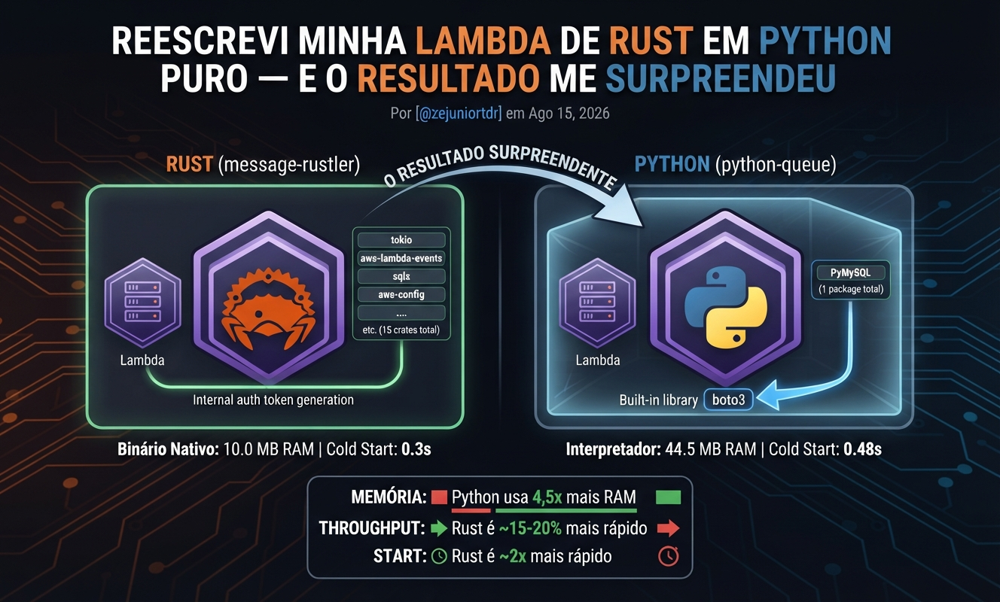
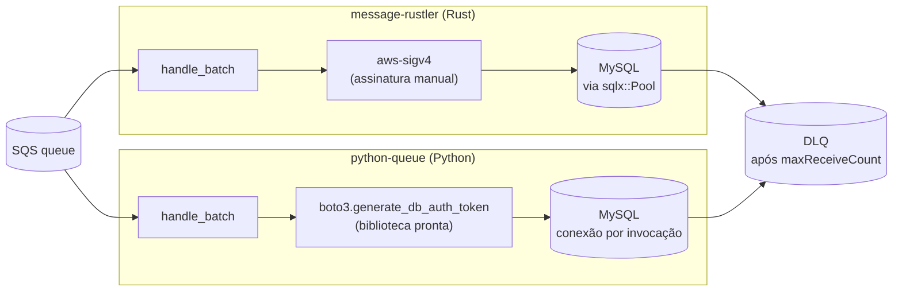

# Reescrevi minha Lambda de Rust em Python puro: 15 dependências viraram 1 — e o Rust ainda venceu

###### Por [@zejuniortdr](https://github.com/zejuniortdr/) em Ago 15, 2026




Peguei uma Lambda AWS em Rust que consome SQS e faz `UPDATE` dinâmico num MySQL, reescrevi do zero em Python sem reaproveitar código, e comparei dependências, linhas e onde cada linguagem me fez errar.

No [post sobre trocar o Celery por um worker em Rust](../0018-apaguei-meu-celery-worker-rust-django) eu defendi a tese padrão deste blog: trocar a peça pesada por Rust economiza RAM e CPU. Dessa vez fiz o caminho contrário de propósito. Peguei um projeto real do nosso workspace — `message-rustler`, uma Lambda que processa mensagens de uma fila SQS e atualiza registros num banco — e me perguntei: e se essa Lambda nunca tivesse sido escrita em Rust? Quanto código, quantas dependências e quanto cuidado manual eu precisaria a mais (ou a menos) fazendo em Python puro, sem sair do runtime nativo da AWS?

*Esse post começou numa discussão com [@fsilvajoel](https://github.com/fsilvajoel): ele defendia uma API síncrona no lugar de uma Lambda consumindo fila — por que aceitar a complexidade de SQS, retry e DLQ se um endpoint HTTP simples resolve o mesmo problema de negócio? A pergunta não tinha resposta óbvia, e foi o estalo que faltava pra eu parar de especular e construir os dois lados: o `message-rustler` original (fila) e, agora, essa reimplementação em Python — pra comparar de verdade, com código, em vez de opinar de graça. Valeu, Joel.*

## O problema que as duas versões resolvem

A ideia é simples de descrever e traiçoeira de implementar com segurança: uma fila SQS recebe mensagens como

```json
{
  "table": "orders",
  "id": 123,
  "fields": { "status": "shipped", "updated_at": "2026-08-14T12:00:00Z" }
}
```

e a Lambda precisa transformar isso num `UPDATE orders SET status = ?, updated_at = ? WHERE id = ?` — só que **nunca** confiando em `table` ou nas chaves de `fields` vindas da mensagem. Nome de tabela e nome de coluna numa query SQL não dá pra passar como bind parameter (`?`/`%s` só funciona pra *valores*), então a única defesa real contra injeção aqui é uma whitelist: uma lista fechada de tabelas e colunas permitidas, carregada uma vez no cold start, contra a qual toda mensagem é validada antes de qualquer SQL ser montado. Mensagem que não bate com a whitelist, ou que falha depois de esgotar as tentativas de retry do SQS, vai pra uma dead-letter queue (DLQ) pra investigação manual.

Isso é pouco código, mas é o tipo de pouco código onde um deslize vira CVE. Bom terreno pra comparar as duas linguagens sem viés de escala.

## Os dois projetos lado a lado

O fluxo de ponta a ponta é idêntico nas duas versões — o que muda é o que cada uma precisa fazer sozinha versus o que ganha de graça do ecossistema:



| | `message-rustler` (Rust) | `python-queue` (Python) |
| --- | ---: | ---: |
| Linhas em `src/` | 743 (código + testes inline) | 244 (só aplicação) |
| Linhas em `tests/` | — (testes vivem dentro de cada módulo) | 356 |
| Testes automatizados | 17 | 32 |
| Dependências diretas (runtime) | 15 crates | 1 pacote (`PyMySQL`) |
| Autenticação IAM no RDS Proxy | SigV4 assinado à mão (`aws-sigv4`) | `boto3.client("rds").generate_db_auth_token(...)` |
| Runtime assíncrono | `tokio` (obrigatório pro `lambda_runtime`) | nenhum — handler síncrono |

A diferença mais visível é a coluna de dependências. Não é que o Rust exagerou: `lambda_runtime`, `aws_lambda_events`, `tokio`, `serde`/`serde_json`/`serde_yaml`, `sqlx`, `async-trait`, `aws-config`, `aws-credential-types`, `aws-sigv4`, `http`, `thiserror`, `tracing`/`tracing-subscriber` — cada uma resolve um problema real. O ponto é que, numa Lambda Python, boa parte desse problema **já vem resolvido pelo runtime gerenciado da AWS**. `boto3` já está instalado no container de execução. O evento SQS já chega como `dict` — não existe "parsear o evento", existe indexar `event["Records"]`. E como cada invocação processa um batch e devolve, não tem por que existir um runtime assíncrono no meio do caminho.

## Onde a diferença de dependência aparece: autenticação IAM

Esse é o contraste mais nítido entre as duas versões. A conexão de produção com o Aurora MySQL passa por um RDS Proxy usando IAM auth — nada de usuário/senha fixo, um token assinado com TTL de 900 segundos. Em Rust, isso significa gerar a assinatura SigV4 manualmente:

```rust
// src/auth.rs (message-rustler)
pub fn generate_auth_token(
    credentials: &Credentials,
    region: &str,
    hostname: &str,
    port: u16,
    db_user: &str,
    now: SystemTime,
) -> String {
    // monta "Action=connect&DBUser=..." e assina com aws-sigv4,
    // location = QueryParams, expires_in = 900s
    ...
}
```

com um teste dedicado só pra garantir que o token final não corrompe a string de conexão (o token tem `/`, `?`, `&`, `=` — se você tentar montar uma URL `mysql://` com ele, ela quebra; por isso o Rust monta a conexão campo a campo em vez de por URL).

Em Python, a mesma responsabilidade é uma chamada de biblioteca:

```python
# src/auth.py (python-queue)
import boto3


def generate_auth_token(host: str, port: int, db_user: str, region: str) -> str:
    client = boto3.client("rds", region_name=region)
    return client.generate_db_auth_token(
        DBHostname=host, Port=port, DBUsername=db_user, Region=region
    )
```

Isso não é Python "vencendo" Rust em elegância — é o ecossistema AWS tratando Python como cidadão de primeira classe no Lambda e deixando Rust por conta própria. Se você já usa `boto3` em qualquer outro lugar do seu stack, essa parte inteira já está testada por outra pessoa.

## Onde o design ficou idêntico de propósito

A parte que mais importava pra este experimento — a whitelist e a montagem da query — eu deixei estruturalmente igual nas duas versões, porque é ali que mora o risco de segurança. Em Rust:

```rust
// src/query.rs (message-rustler)
pub fn build_update_sql(table: &str, key_column: &str, columns: &[&str]) -> String {
    let assignments = columns.iter()
        .map(|c| format!("{c} = ?"))
        .collect::<Vec<_>>()
        .join(", ");
    format!("UPDATE {table} SET {assignments} WHERE {key_column} = ?")
}
```

Em Python:

```python
# src/query.py (python-queue)
def build_update_sql(table: str, key_column: str, columns: Iterable[str]) -> str:
    # table/key_column/columns só vêm da whitelist (nunca da mensagem SQS),
    # então formatar como string aqui é seguro — valores sempre via bind param.
    assignments = ", ".join(f"{column} = %s" for column in columns)
    return f"UPDATE {table} SET {assignments} WHERE {key_column} = %s"
```

Mesma função, mesma garantia, mesma linha de comentário explicando por que interpolar string ali é seguro. A ordem das colunas na query também segue a whitelist e não o payload recebido nas duas versões — detalhe pequeno que garante que o SQL gerado é determinístico e que toda coluna usada já passou pela validação antes de chegar perto de uma query.

## O bug que só apareceu na revisão final — e por que o Rust não teria deixado passar

Aqui está a parte mais honesta deste post. Na primeira versão do handler Python, eu capturava só três tipos de exceção:

```python
try:
    _process_record(record, whitelist, repository)
except (MessageParseError, WhitelistError, RepoError) as exc:
    logger.warning("failed to process message %s: %s", message_id, exc)
    failures.append({"itemIdentifier": message_id})
```

Parece completo — cobre erro de parsing, erro de whitelist, erro de banco. Só que uma mensagem tecnicamente válida, com um objeto aninhado dentro de `fields` (`{"status": {"a": 1}}` em vez de `{"status": "shipped"}`), passa pelo parsing e pela whitelist sem erro — e só explode dentro do PyMySQL, como `TypeError`, um tipo de exceção que eu simplesmente não tinha listado. Sem estar naquela tupla, o erro escapava do `handle_batch` inteiro, derrubava a invocação da Lambda e o SQS reentregava o **lote inteiro** — incluindo mensagens que já tinham sido processadas com sucesso — até todas caírem juntas na DLQ. Isso anula na prática o propósito do `ReportBatchItemFailures`: reportar só o que falhou.

A versão Rust tem a mesma superfície de risco, mas a assinatura do código força você a olhar pra ela:

```rust
// src/handler.rs (message-rustler)
async fn process_record(
    body: &str,
    whitelist: &Whitelist,
    repository: &dyn Repository,
) -> Result<(), ()> {
    let msg = parse_message(body).map_err(|e| { tracing::warn!(...); })?;
    let rule = whitelist.validate(&msg.table, ...).map_err(|e| { tracing::warn!(...); })?;
    let fields = ordered_fields(rule, &msg.fields);
    repository.update(&msg.table, &rule.key, msg.id, &fields)
        .await
        .map_err(|e| { tracing::warn!(...); })?;
    Ok(())
}
```

`Result<(), ()>` parece estranho até você notar o que ele exige: **todo** `?` no meio da função precisa de um `.map_err` explícito ali no ponto de chamada, porque o compilador não deixa passar um erro que não sabe converter pro tipo de retorno. Não existe "lista de exceções que eu lembrei de cobrir" — existe cada chamada falível sendo tratada, uma por uma, no lugar onde ela acontece. Se o `sqlx` decidisse devolver um tipo de erro novo amanhã, o código Rust simplesmente não compilaria até alguém decidir o que fazer com ele. Já eu descobri o buraco em Python só na revisão final, rastreando o traceback até o conversor de parâmetros do PyMySQL.

A correção em Python foi trivial — trocar a tupla por `except Exception`, logar com `logger.exception` (traceback completo) e devolver o mesmo item de falha:

```python
except Exception:
    logger.exception("failed to process message %s", message_id)
    failures.append({"itemIdentifier": message_id})
```

Mas o ponto não é "faltou um `except`". É que em Python **nada avisa você** que a lista está incompleta — o código roda, os 32 testes passam, e o buraco só existe pra quem lembrar de perguntar "e o que eu não pensei em capturar?". É a mesma lição do post sobre [`Result`/`Option` em Rust](../0008-tratamento-erros-rust-result-option-pythonistas): o tipo do retorno é o lembrete que o Python não te dá de graça.

## O que ficou mais simples em Python — e por que isso é um trade-off, não uma vitória

Nem tudo pende pro lado do Rust. A conexão com o banco é um caso interessante dos dois lados. Em Rust, o `sqlx::MySqlPool` mantém conexões abertas entre mensagens do mesmo lote, com `max_lifetime` de 10 minutos ajustado pra reciclar bem antes do token IAM expirar (900s) — pool tunado, mais rápido em lotes grandes, mais uma peça de estado pra acompanhar.

Em Python, cada invocação abre uma conexão nova e fecha no fim:

```python
def lambda_handler(event: dict, context) -> dict:
    connection = get_connection()
    try:
        repository = PyMySQLRepository(connection)
        return handle_batch(event.get("Records", []), _whitelist, repository)
    finally:
        connection.close()
```

É deliberadamente mais simples — abre mão de reaproveitar a conexão entre mensagens do mesmo lote, ao custo de um handshake a mais por invocação. Decidi medir essa diferença em vez de especular.

## Benchmark local: números reais, sem AWS (e sem ferramenta de dev atrapalhando)

Nunca fiz deploy de nenhuma das duas versões — não tenho conta AWS de produção pra este experimento. Então o que eu podia medir com honestidade era o **runtime local de cada uma rodando de verdade**. Minha primeira tentativa usou o `cargo lambda watch` pro lado Rust — a ferramenta de dev que o próprio post [sobre a fila em Rust](../0018-apaguei-meu-celery-worker-rust-django) usa. O resultado saiu estranho: Python mais rápido que Rust em throughput, por uma margem grande demais pra eu simplesmente publicar sem desconfiar.

Desconfiei com razão. `cargo lambda watch` é uma ferramenta de **desenvolvimento**: mantém um processo supervisor rodando por cima do binário da função, com hot-reload e uma camada de proxy — nada disso existe na Lambda de verdade. O lado Python, desde o início, rodava atrás do [Lambda Runtime Interface Emulator](https://github.com/aws/aws-lambda-runtime-interface-emulator) (RIE) da própria AWS — o emulador mais fino que existe, o mesmo que roda por trás de `sam local` e de imagens de container Lambda em produção. Eu estava comparando um binário Rust carregando um supervisor extra contra um binário Python sem supervisor nenhum. Refiz o lado Rust: peguei o binário nativo (`cargo build --release`) e coloquei atrás do **mesmo RIE**, sem `cargo lambda watch` no meio — as duas linguagens, exatamente o mesmo emulador, o mesmo contrato HTTP (`POST /2015-03-31/functions/.../invocations`).

**Metodologia:** 5 invocações de aquecimento descartadas, depois 200 invocações sequenciais com lote de 5 mensagens cada (1.000 mensagens no total por rodada), medindo o tempo de cada chamada HTTP de ponta a ponta — parsing, validação de whitelist, `UPDATE` no MySQL, resposta. Throughput rodado 2 vezes, tempo de start 3 vezes, pra não publicar número de sorte. Script em `scripts/bench.py`, stdlib só, sem libs de benchmark.

| Métrica | Rust (nativo, atrás do RIE) | Python (atrás do RIE) |
| --- | ---: | ---: |
| Throughput (msgs/s) — rodada 1 | 229,6 | 203,8 |
| Throughput (msgs/s) — rodada 2 | 236,1 | 197,9 |
| Latência média | ~21ms | ~25ms |
| Latência p95 | ~25ms | ~27ms |
| Memória do processo da função (RSS) | ~10,0 MB | ~44,5 MB |
| Overhead do próprio RIE (igual nos dois) | ~12,7 MB | ~12,6 MB |
| Tempo de start até responder (3 rodadas) | 0,29 / 0,29 / 0,32s | 0,48 / 0,48 / 0,47s |
| Tamanho do artefato de deploy (zip) | 4,5 MB | 3,9 MB |

Com a assimetria removida, o resultado virou o que eu esperava — mas só porque medi de novo em vez de aceitar o primeiro número:

**Rust ganha em throughput, latência e tempo de start.** ~15-20% mais mensagens/segundo, latência média ~4ms menor, e principalmente: **inicia quase 2x mais rápido** (0,3s contra 0,48s) — sem interpretador pra carregar, sem `import boto3`/`pymysql`/`cryptography` pra resolver, o binário estático já sobe pronto. Esse número de start é o mais honesto proxy de cold start que dá pra medir localmente, e é onde a diferença estrutural entre as duas linguagens mais aparece.

**Rust usa ~4,5x menos memória — isso não mudou entre as duas medições.** RSS do processo da função em si, com o overhead do RIE isolado à parte (e agora simétrico: ~12,7 MB dos dois lados, prova que a comparação está limpa) — 10,0 MB de binário Rust contra 44,5 MB de interpretador Python com `pymysql`, `boto3` e `cryptography` carregados. Bate com o padrão de [outros posts do blog](../0018-apaguei-meu-celery-worker-rust-django) e é o tipo de número que vira conta de infraestrutura quando multiplicado por milhares de invocações concorrentes.

**O tamanho do zip quase empatou** — 4,5 MB (binário estático Rust, sem SDK da AWS porque o cliente `rds-db` vem do próprio `aws-sigv4`/`aws-config`, não do SDK completo) contra 3,9 MB (Python sem `boto3`, que a Lambda já dá de graça).

A lição real aqui não é nenhum número da tabela — é que o **primeiro benchmark que rodei estava medindo a ferramenta de dev errada, não a linguagem**, e só percebi porque o resultado contrariava tudo que eu já tinha visto nos [outros benchmarks deste blog](../0019-um-milhao-websockets-python-rust). Se o número tivesse confirmado minha expectativa eu talvez não tivesse desconfiado — o que é exatamente o tipo de viés que benchmark honesto tem que vigiar contra si mesmo.

Se você for repetir: os dois Dockerfiles de benchmark (RIE puro, sem supervisor de dev) estão numa branch `bench/local-throughput` em cada repositório — nunca mergeada, porque só existem pra medir, não fazem parte do runtime de produção de nenhum dos dois projetos.

## O que esse caso ensina

1. **Runtime gerenciado muda a conta.** A comparação "Rust vs Python" muda de figura quando uma das duas já ganha metade da bagagem de graça do ambiente de execução. Numa CLI ou num worker de longa duração, o cálculo de dependências seria bem diferente.
2. **Tipagem forte não é sobre performance aqui — é sobre completude.** O `Result<(), ()>` do Rust não me deixou esquecer um caminho de erro. O `except (A, B, C)` do Python me deixou, e só a revisão pegou.
3. **Whitelist de tabela/coluna é o único lugar que precisa ser idêntico.** Todo o resto — driver, autenticação, runtime — pode divergir sem risco, desde que essa fronteira específica (nome de identificador SQL nunca vindo do payload) seja tratada com o mesmo rigor nas duas linguagens.
4. **"Reescrevi do zero" é o teste mais honesto de complexidade real.** Migrar código costuma esconder decisões antigas. Recomeçar do zero, com o mesmo problema, expõe o que cada linguagem exige de você — e o que ela te dá de graça.
5. **Benchmark honesto desconfia do próprio harness antes de desconfiar do resultado.** Minha primeira rodada dizia que Python era mais rápido — e o motivo não era Python, era eu medindo o binário Rust atrás de uma ferramenta de dev (`cargo lambda watch`) que o lado Python nunca teve. Refazer com o mesmo emulador (RIE) dos dois lados foi o que revelou o número real: Rust ganha throughput, latência e start, e mantém a vantagem de ~4,5x menos memória que já era limpa desde o início.

Se você trabalha num stack majoritariamente Python e está decidindo se vale a pena trazer Rust pra dentro dele — ou o inverso, como fiz aqui — este é exatamente o tipo de raciocínio que o livro [Desbravando Rust](https://desbravandorust.com.br) ensina a fazer com rigor: não "qual linguagem é mais rápida", mas "o que cada uma me obriga a acertar sozinho, e o que ela acerta por mim".
